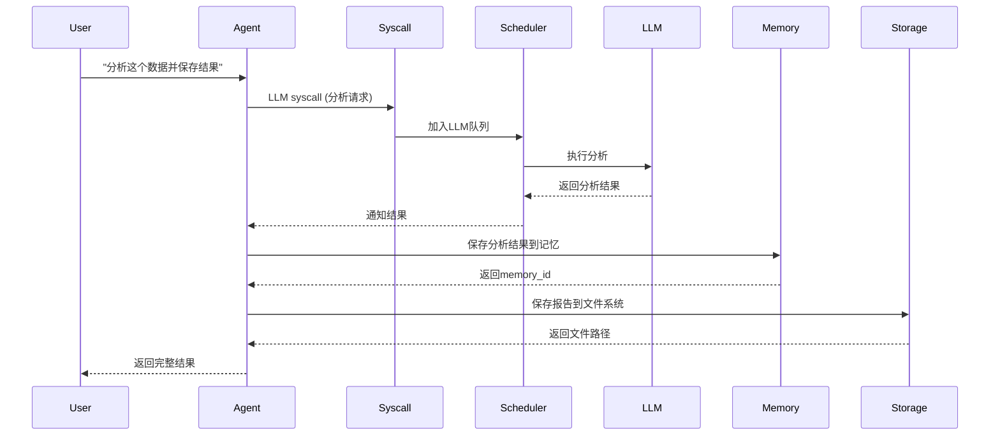

# AIOS 项目深度技术分析报告

> 生成时间: 2025-12-28
> 分析路径: `/home/zcxggmu/workspace/hello-projs/posp/AIOS`
> 报告版本: v1.0

---

## 目录

- [1. 项目全景概览](#1-项目全景概览)
- [2. 目录结构详解](#2-目录结构详解)
- [3. 核心架构设计](#3-核心架构设计)
- [4. 功能模块拆解](#4-功能模块拆解)
- [5. 核心工作流与数据流](#5-核心工作流与数据流)
- [6. 项目亮点与改进建议](#6-项目亮点与改进建议)

---

## 1. 项目全景概览

### 1.1 项目核心用途

**AIOS** 是一个面向 AI Agent 的操作系统内核，采用类 Unix 操作系统设计理念，为 AI Agent 提供系统调用抽象、资源调度、内存管理、存储管理和工具管理等核心能力。

### 1.2 核心技术栈

| 类别 | 技术选型 |
|------|----------|
| **主要语言** | Python 3.10-3.11 (主要), Rust 2024 (实验性重写) |
| **Web框架** | FastAPI + Uvicorn |
| **LLM集成** | LiteLLM, Transformers, Accelerate |
| **向量数据库** | ChromaDB, Qdrant, FastEmbed |
| **LLM索引** | LlamaIndex v0.10.19 |
| **SDK依赖** | Cerebrum (git+https://github.com/agiresearch/Cerebrum.git) |
| **工具库** | Pydantic, Click, Watchdog, Redis |
| **数据处理** | NumPy, Sentence-Transformers, NLTK, Scikit-learn |

### 1.3 支持的LLM后端

| 类型 | 提供商 |
|------|--------|
| **云端API** | OpenAI (GPT系列), Anthropic (Claude系列), Google Gemini, Groq, Novita AI, Deepseek |
| **本地部署** | Ollama, vLLM, SGLang, HuggingFace Transformers |

---

## 2. 目录结构详解

### 2.1 完整目录树状图

```
AIOS/
├── aios/                              # 核心内核目录 (Python实现)
│   ├── __init__.py
│   ├── config/                        # 配置管理模块
│   │   ├── config.yaml               # 主配置文件 (API密钥、LLM配置等)
│   │   ├── config.yaml.example       # 配置模板
│   │   └── config_manager.py         # 配置管理器
│   │
│   ├── llm_core/                     # LLM核心模块
│   │   ├── adapter.py               # LLM适配器 (多模型路由、负载均衡) ~964行
│   │   ├── local.py                 # HuggingFace本地模型后端
│   │   ├── routing.py               # 路由策略 (Sequential/Smart)
│   │   └── utils.py                 # LLM工具函数
│   │
│   ├── scheduler/                    # 任务调度器模块
│   │   ├── base.py                  # 调度器抽象基类
│   │   ├── fifo_scheduler.py        # FIFO调度器实现 ~347行
│   │   └── rr_scheduler.py          # Round-Robin调度器实现
│   │
│   ├── memory/                       # 内存管理模块
│   │   ├── base.py                  # 内存管理器基础实现 ~329行
│   │   ├── manager.py               # 内存管理器包装类
│   │   ├── retrievers.py            # 向量检索器
│   │   └── note.py                  # 内存笔记数据结构
│   │
│   ├── storage/                      # 存储管理模块
│   │   ├── storage.py               # 存储管理器
│   │   └── filesystem/              # 文件系统抽象
│   │       ├── lsfs.py              # 语义文件系统 (LSFS) ~468行
│   │       └── vector_db.py         # 向量数据库接口
│   │
│   ├── tool/                         # 工具管理模块
│   │   ├── manager.py               # 工具管理器 ~120行
│   │   ├── mcp_server.py            # MCP服务器
│   │   └── virtual_env/             # 虚拟化环境支持
│   │       ├── providers/           # 云/虚拟化提供商
│   │       │   ├── aws/             # AWS支持
│   │       │   ├── azure/           # Azure支持
│   │       │   ├── gcp/             # GCP支持
│   │       │   ├── docker/          # Docker支持
│   │       │   ├── virtualbox/      # VirtualBox支持
│   │       │   └── vmware/          # VMware支持
│   │       ├── controllers/         # 环境控制器
│   │       └── evaluators/          # 计算机使用评估器
│   │
│   ├── syscall/                      # 系统调用模块
│   │   ├── syscall.py               # 系统调用执行器 ~730行
│   │   ├── llm.py                   # LLM系统调用
│   │   ├── memory.py                # 内存系统调用
│   │   ├── storage.py               # 存储系统调用
│   │   ├── tool.py                  # 工具系统调用
│   │   ├── factory.py               # 系统调用工厂
│   │   ├── schema.py                # 系统调用模式
│   │   └── types/                   # 类型定义
│   │
│   ├── context/                      # 上下文管理模块
│   │   ├── base.py                  # 上下文管理器基类
│   │   └── simple_context.py        # 简单上下文管理器实现 ~444行
│   │
│   ├── hooks/                        # React式Hook系统
│   │   ├── stores/                  # 全局状态存储
│   │   │   ├── _global.py           # 全局队列和状态
│   │   │   ├── processes.py         # 进程存储
│   │   │   └── queue.py             # 队列存储
│   │   ├── modules/                 # Hook模块
│   │   │   ├── llm.py               # LLM Hook
│   │   │   ├── memory.py            # 内存 Hook
│   │   │   ├── storage.py           # 存储 Hook
│   │   │   ├── tool.py              # 工具 Hook
│   │   │   ├── scheduler.py         # 调度器 Hook
│   │   │   └── agent.py             # 代理工厂 Hook
│   │   ├── types/                   # Hook类型定义
│   │   └── utils/                   # Hook工具函数
│   │
│   └── utils/                        # 工具模块
│       ├── calculator.py            # 计算器工具
│       ├── compressor.py            # 压缩工具
│       ├── id_generator.py          # ID生成器
│       ├── logger.py                # 日志系统
│       └── commands/                # 命令行工具
│           └── launch.py
│
├── aios-rs/                         # Rust实验性重写
│   ├── Cargo.toml                   # Rust项目配置
│   ├── Cargo.lock
│   ├── README.md
│   └── src/
│       ├── lib.rs                   # 库入口
│       ├── prelude.rs               # 导出模块
│       ├── context.rs               # 上下文管理trait
│       ├── memory.rs                # 内存管理trait
│       ├── storage.rs               # 存储管理trait
│       ├── tool.rs                  # 工具管理trait
│       ├── scheduler.rs             # 调度器trait
│       └── llm.rs                   # LLM适配器trait
│
├── runtime/                         # 运行时模块
│   ├── launch.py                    # FastAPI服务入口 (主入口点)
│   ├── run_terminal.py              # 终端UI入口
│   └── launch_kernel.sh             # 内核启动脚本
│
├── scripts/                         # 辅助脚本
│   ├── run_agent.sh
│   ├── list_agents.py
│   ├── launch_vllm.sh
│   └── launch_sglang.sh
│
├── tests/                           # 测试目录
├── docs/                            # 文档
├── install/                         # 安装脚本
├── requirements.txt                 # Python依赖 (CPU版本)
├── requirements-cuda.txt            # Python依赖 (GPU版本)
├── Dockerfile                       # Docker镜像配置
├── .env.example                     # 环境变量模板
├── .gitignore
├── .pre-commit-config.yaml
├── README.md                        # 项目说明文档
└── LICENSE                          # Apache-2.0许可证
```

### 2.2 关键目录说明

| 目录 | 职责 |
|------|------|
| `aios/` | 核心内核实现，包含所有主要功能模块 |
| `aios-rs/` | Rust版本的实验性重写，用于性能优化 |
| `runtime/` | 运行时启动脚本和服务入口 |
| `scripts/` | 辅助脚本，包括模型启动、Agent运行等 |
| `tests/` | 单元测试和集成测试 |
| `docs/` | 项目文档 |

---

## 3. 核心架构设计

### 3.1 整体架构模式

AIOS 采用 **微内核 + 插件化架构**，借鉴操作系统设计理念：

```
┌─────────────────────────────────────────────────────────────┐
│                     AI Agents (Apps)                         │
│                    (Cerebrum SDK)                            │
└─────────────────────────────────────────────────────────────┘
                              ↓
┌─────────────────────────────────────────────────────────────┐
│                    System Call Interface                    │
│                 (syscall/ - SyscallExecutor)                │
└─────────────────────────────────────────────────────────────┘
                              ↓
┌─────────────────────────────────────────────────────────────┐
│                      Request Queues                          │
│                   (hooks/stores/)                            │
│    ┌──────┬────────┬──────────┬──────────┐                  │
│    │ LLM  │ Memory │ Storage  │  Tool    │                  │
│    └──────┴────────┴──────────┴──────────┘                  │
└─────────────────────────────────────────────────────────────┘
                              ↓
┌─────────────────────────────────────────────────────────────┐
│                      Scheduler                               │
│           (FIFO / Round-Robin Schedulers)                    │
└─────────────────────────────────────────────────────────────┘
                              ↓
┌─────────────────────────────────────────────────────────────┐
│                   Core Managers                              │
│  ┌───────────┬────────────┬──────────┬────────────┐        │
│  │   LLM     │   Memory   │ Storage  │   Tool     │        │
│  │  Adapter  │  Manager   │ Manager  │  Manager   │        │
│  └───────────┴────────────┴──────────┴────────────┘        │
└─────────────────────────────────────────────────────────────┘
                              ↓
┌─────────────────────────────────────────────────────────────┐
│                   Infrastructure                             │
│  ┌──────────────┬─────────────┬─────────────────────┐       │
│  │ Vector DB    │   Redis     │    LLM Backends     │       │
│  │(Chroma/Qdrant│   (Cache)   │ (API/Local/VLLM)    │       │
│  └──────────────┴─────────────┴─────────────────────┘       │
└─────────────────────────────────────────────────────────────┘
```

### 3.2 设计模式应用

| 设计模式 | 应用位置 | 说明 |
|----------|----------|------|
| **策略模式** | `llm_core/routing.py` | SequentialRouting vs SmartRouting 路由策略 |
| **工厂模式** | `syscall/factory.py` | 创建不同类型的系统调用 (LLM/Memory/Storage/Tool) |
| **适配器模式** | `llm_core/adapter.py` | 统一不同LLM后端接口 (OpenAI/Claude/Ollama等) |
| **单例模式** | `hooks/stores/_global.py` | 全局队列和状态管理 |
| **观察者模式** | `storage/filesystem/lsfs.py` | 文件变更监听 (使用watchdog) |
| **代理模式** | `syscall/syscall.py` | SyscallExecutor 封装底层操作 |
| **Hook模式** | `hooks/` 整个目录 | React风格的Hook系统 |
| **模板方法** | `scheduler/base.py` | BaseScheduler 定义调度流程模板 |
| **装饰器模式** | `context/simple_context.py` | 上下文保存/恢复装饰器 |
| **外观模式** | `memory/manager.py` | 简化内存操作的统一接口 |

### 3.3 关键架构特性

#### 3.3.1 系统调用抽象层

```python
# syscall/syscall.py - SyscallExecutor
class SyscallExecutor:
    """
    系统调用执行器，类似Unix系统调用
    支持4种调用类型: llm, memory, storage, tool
    """

    async def execute(self, syscall: Syscall):
        # 1. 验证系统调用格式
        # 2. 路由到对应的处理器
        # 3. 返回执行结果
        pass
```

**特性**:
- 统一的 API 接口
- 支持异步执行
- 事件通知机制
- 错误处理和重试

#### 3.3.2 多调度器支持

| 调度器 | 文件 | 特点 |
|--------|------|------|
| **FIFO Scheduler** | `fifo_scheduler.py` | 先进先出，支持批处理 (batch_interval=1.0s) |
| **Round-Robin Scheduler** | `rr_scheduler.py` | 时间片轮转，支持上下文切换 |

```python
# scheduler/base.py
class BaseScheduler(ABC):
    @abstractmethod
    async def schedule(self, request: Request):
        """调度请求的抽象方法"""
        pass
```

#### 3.3.3 LLM 多后端适配

```python
# llm_core/adapter.py
class LLMAdapter:
    """
    统一的LLM适配器，支持:
    - 云端API: OpenAI, Anthropic, Google, Groq, Deepseek, Novita
    - 本地部署: Ollama, vLLM, SGLang, HuggingFace
    """

    def __init__(self):
        self.routing_strategy = SequentialRouting()  # 或 SmartRouting()

    async def chat_completion(self, messages, **kwargs):
        # 路由到具体后端
        # 执行请求
        # 返回响应
        pass
```

#### 3.3.4 向量存储集成

```python
# storage/filesystem/vector_db.py
class VectorDBBackend(ABC):
    @abstractmethod
    def add(self, embeddings, metadata):
        pass

    @abstractmethod
    def query(self, query_embedding, top_k=5):
        pass
```

**支持的后端**:
- **ChromaDB**: 轻量级向量数据库
- **Qdrant**: 高性能向量搜索引擎

#### 3.3.5 上下文管理

```python
# context/simple_context.py
class SimpleContextManager:
    """
    上下文管理器，支持:
    - 保存LLM生成状态
    - 恢复中断的生成
    - KV cache管理 (HuggingFace模型)
    """

    def save_context(self, process_id):
        # 保存当前上下文
        pass

    def restore_context(self, process_id):
        # 恢复上下文
        pass
```

---

## 4. 功能模块拆解

### 4.1 LLM Core 模块

**路径**: `aios/llm_core/adapter.py` (~964行)

**核心功能**:

| 功能 | 说明 |
|------|------|
| **多后端统一接口** | 统一 API 支持 10+ 种 LLM 后端 |
| **请求路由** | SequentialRouting 或 SmartRouting 策略 |
| **负载均衡** | 自动分配请求到可用后端 |
| **批处理** | 合并多个请求提高吞吐量 |
| **工具调用** | 支持 Function Calling |
| **错误处理** | 自动重试和降级 |

**核心类**:

```python
class LLMAdapter:
    def __init__(self, config: Dict):
        self.backends = self._init_backends(config)
        self.routing_strategy = SequentialRouting()

    async def chat_completion(self, messages, **kwargs):
        backend = self.routing_strategy.select_backend(self.backends)
        return await backend.chat(messages, **kwargs)

    async def batch_completion(self, requests: List[Request]):
        # 批处理逻辑
        pass
```

**与其他模块交互**:

```
LLM Core
    ↓ 接收请求
Syscall Layer
    ↓ 路由
Scheduler
    ↓ 调度
LLM Backends (OpenAI/Claude/Ollama/...)
```

### 4.2 Scheduler 模块

**路径**: `aios/scheduler/`

#### 4.2.1 FIFO Scheduler

**文件**: `fifo_scheduler.py` (~347行)

**核心逻辑**:

```python
class FIFOScheduler(BaseScheduler):
    """
    先进先出调度器
    - LLM请求: 批处理 (batch_interval=1.0s)
    - 其他请求: 即时处理
    """

    async def schedule(self, request: Request):
        if request.type == "llm":
            await self.llm_queue.put(request)
        else:
            await self.execute_immediate(request)

    async def _batch_process(self):
        """批量处理LLM请求"""
        while True:
            requests = await self._collect_batch()
            await self.process_batch(requests)
```

#### 4.2.2 Round-Robin Scheduler

**文件**: `rr_scheduler.py`

**核心逻辑**:

```python
class RoundRobinScheduler(BaseScheduler):
    """
    时间片轮转调度器
    - 支持上下文切换
    - 适合长时间运行任务
    """

    async def schedule(self, request: Request):
        self.time_slice = 100  # 100ms时间片
        await self._execute_with_time_slice(request)
```

### 4.3 Memory 模块

**路径**: `aios/memory/base.py` (~329行)

**核心功能**:

| 功能 | 说明 |
|------|------|
| **向量检索** | 基于 ChromaDB 或 Qdrant 的语义搜索 |
| **记忆结构** | MemoryNote (content, keywords, tags, context) |
| **记忆进化** | 基于 LLM 分析相似记忆并更新 |
| **操作类型** | add, remove, update, retrieve |

**核心类**:

```python
class MemoryNote:
    """内存笔记数据结构"""
    content: str
    keywords: List[str]
    tags: List[str]
    context: Dict
    embedding: np.ndarray

class MemoryManager:
    """内存管理器"""

    async def add_memory(self, content: str, metadata: Dict):
        note = MemoryNote(content=content, **metadata)
        await self.vector_db.add(note.embedding, note.to_dict())

    async def retrieve(self, query: str, top_k=5):
        embedding = self.embed(query)
        return await self.vector_db.query(embedding, top_k)

    async def evolve_memory(self, memory_id: str):
        """使用LLM分析并更新记忆"""
        memories = await self.retrieve_similar(memory_id)
        updated = await self.llm.analyze_and_update(memories)
        await self.update(memory_id, updated)
```

### 4.4 Storage 模块

**路径**: `aios/storage/filesystem/lsfs.py` (~468行)

**核心功能**: LSFS (语义文件系统)

| 功能 | 说明 |
|------|------|
| **文件操作** | create, write, read, delete |
| **语义搜索** | 基于向量相似度的文件检索 |
| **版本控制** | 集成 Redis 存储文件历史 |
| **文件共享** | 生成临时分享链接 |
| **实时监听** | watchdog 监听文件变化 |

**核心类**:

```python
class LSFS:
    """语义文件系统"""

    def __init__(self, vector_db, redis_client):
        self.vector_db = vector_db
        self.redis = redis_client
        self.watcher = watchdog.Observer()

    async def create_file(self, path: str, content: str):
        # 1. 创建文件
        # 2. 计算内容向量
        # 3. 存储到向量数据库
        # 4. 保存版本到 Redis
        pass

    async def semantic_search(self, query: str, top_k=10):
        """语义搜索文件"""
        query_embedding = self.embed(query)
        results = await self.vector_db.query(query_embedding, top_k)
        return [self.load_file(r.path) for r in results]

    async def get_version_history(self, path: str):
        """获取文件版本历史"""
        return await self.redis.lrange(f"versions:{path}", 0, -1)
```

### 4.5 Tool 模块

**路径**: `aios/tool/manager.py` (~120行)

**核心功能**:

| 功能 | 说明 |
|------|------|
| **工具调用管理** | 从 Cerebrum SDK 加载工具 |
| **MCP 服务器** | Model Context Protocol 支持 |
| **虚拟化环境** | 支持 AWS、Azure、GCP、Docker 等 |
| **计算机使用** | 虚拟机控制、桌面自动化 |

**核心类**:

```python
class ToolManager:
    """工具管理器"""

    def __init__(self, cerebrum_sdk):
        self.tools = cerebrum_sdk.list_tools()
        self.mcp_server = MCPServer()

    async def execute_tool(self, tool_name: str, params: Dict):
        tool = self.get_tool(tool_name)
        return await tool.execute(**params)

    async def setup_virtual_env(self, provider: str, config: Dict):
        """设置虚拟化环境"""
        if provider == "aws":
            return AWSProvider(config)
        elif provider == "docker":
            return DockerProvider(config)
        # ...
```

### 4.6 Syscall 模块

**路径**: `aios/syscall/syscall.py` (~730行)

**核心功能**:

```python
class SyscallExecutor:
    """系统调用执行器"""

    def __init__(self):
        self.llm_executor = LLMExecutor()
        self.memory_executor = MemoryExecutor()
        self.storage_executor = StorageExecutor()
        self.tool_executor = ToolExecutor()

    async def execute(self, syscall: Syscall):
        """执行系统调用"""
        validator = SyscallValidator()
        if not validator.validate(syscall):
            raise InvalidSyscallError()

        executor = self._get_executor(syscall.type)
        return await executor.execute(syscall)
```

**支持的系统调用类型**:

| 类型 | 说明 | 文件 |
|------|------|------|
| `llm` | LLM 生成请求 | `syscall/llm.py` |
| `memory` | 内存操作 | `syscall/memory.py` |
| `storage` | 存储操作 | `syscall/storage.py` |
| `tool` | 工具调用 | `syscall/tool.py` |

### 4.7 Context 模块

**路径**: `aios/context/simple_context.py` (~444行)

**核心功能**:

```python
class SimpleContextManager:
    """简单上下文管理器"""

    async def save_context(self, process_id: str):
        """保存上下文状态"""
        context = {
            "llm_state": self.llm.get_state(),
            "memory_state": self.memory.get_state(),
            "timestamp": time.time()
        }
        await self.storage.save(f"contexts/{process_id}", context)

    async def restore_context(self, process_id: str):
        """恢复上下文状态"""
        context = await self.storage.load(f"contexts/{process_id}")
        self.llm.restore_state(context["llm_state"])
        self.memory.restore_state(context["memory_state"])

    def context_timeout(self, timeout: int):
        """上下文超时装饰器"""
        def decorator(func):
            async def wrapper(*args, **kwargs):
                start = time.time()
                result = await func(*args, **kwargs)
                if time.time() - start > timeout:
                    await self.save_context(current_process)
                return result
            return wrapper
        return decorator
```

### 4.8 Hooks 系统

**路径**: `aios/hooks/`

**React 风格 Hook 系统**:

```python
# 全局状态
from aios.hooks.stores._global import (
    global_llm_req_queue,
    global_memory_req_queue,
    global_storage_req_queue,
    global_tool_req_queue
)

# Hook 模块
from aios.hooks.modules.llm import useCore
from aios.hooks.modules.memory import useMemoryManager
from aios.hooks.modules.storage import useStorageManager
from aios.hooks.modules.tool import useToolManager
from aios.hooks.modules.agent import useFactory
```

**示例使用**:

```python
async def agent_task():
    # 获取 LLM 管理器
    llm = useCore()

    # 获取内存管理器
    memory = useMemoryManager()

    # 保存记忆
    await memory.add_memory("用户喜欢吃苹果", {"user_id": "123"})

    # 使用 LLM
    response = await llm.chat("用户喜欢吃什么？")
```

---

## 5. 核心工作流与数据流

### 5.1 程序入口点

#### 5.1.1 主入口: FastAPI 服务

**文件**: `runtime/launch.py`

```python
import uvicorn
from fastapi import FastAPI

app = FastAPI()

@app.post("/query")
async def query(request: QueryRequest):
    """主查询入口"""
    # 1. 解析请求
    # 2. 创建系统调用
    # 3. 执行并返回结果
    pass

@app.post("/agents/submit")
async def submit_agent(agent_spec: AgentSpec):
    """提交Agent任务"""
    pass

if __name__ == "__main__":
    uvicorn.run(app, host="0.0.0.0", port=8000)
```

#### 5.1.2 终端入口: Terminal UI

**文件**: `runtime/run_terminal.py`

```python
def main():
    """终端UI入口"""
    while True:
        user_input = input("> ")
        response = process_input(user_input)
        print(response)
```

### 5.2 核心业务流程

#### 5.2.1 LLM 请求流程

```
Agent (Cerebrum SDK)
    ↓
1. 构建系统调用
    ↓
2. 提交到 global_llm_req_queue
    ↓
3. FIFO Scheduler 接收请求
    ↓
4. 批处理收集 (batch_interval=1.0s)
    ↓
5. LLMAdapter 选择后端
    ↓
6. 执行 LLM 请求
    ↓
7. 返回响应
    ↓
8. 通知 Agent
```

**代码示例**:

```python
# 1. Agent 创建系统调用
syscall = Syscall(
    type="llm",
    action="chat",
    params={"messages": [{"role": "user", "content": "Hello"}]}
)

# 2. 提交到队列
await global_llm_req_queue.put(syscall)

# 3. Scheduler 处理
async def fifo_scheduler_loop():
    while True:
        requests = await collect_batch(interval=1.0)
        for req in requests:
            response = await llm_adapter.chat_completion(req.params)
            await notify_agent(req.agent_id, response)
```

#### 5.2.2 内存操作流程

```
Agent
    ↓
1. add_memory(content, metadata)
    ↓
2. 创建 MemoryNote
    ↓
3. 计算向量嵌入
    ↓
4. 存储到向量数据库 (ChromaDB/Qdrant)
    ↓
5. 返回 memory_id
```

**代码示例**:

```python
# Agent 添加记忆
memory_id = await memory.add_memory(
    content="用户喜欢编程语言Python",
    keywords=["用户", "Python", "偏好"],
    tags={"category": "user_preference"}
)

# 检索记忆
memories = await memory.retrieve(
    query="用户喜欢什么编程语言？",
    top_k=5
)

# 记忆进化
await memory.evolve_memory(memory_id)
```

#### 5.2.3 语义文件操作流程

```
Agent
    ↓
1. create_file(path, content)
    ↓
2. 写入文件系统
    ↓
3. 计算内容向量
    ↓
4. 存储到向量数据库
    ↓
5. 保存版本到 Redis
    ↓
6. 返回文件路径
```

**代码示例**:

```python
# 创建文件
file_path = await lsfs.create_file(
    path="/notes/project_ideas.md",
    content="# AIOS 项目想法\n..."
)

# 语义搜索
results = await lsfs.semantic_search(
    query="关于AI操作系统的想法",
    top_k=5
)

# 获取版本历史
history = await lsfs.get_version_history("/notes/project_ideas.md")
```

### 5.3 端到端数据流示例

**场景**: Agent 处理用户查询并保存结果



---

## 6. 项目亮点与改进建议

### 6.1 设计亮点

#### 6.1.1 操作系统设计理念

- **系统调用抽象**: 统一的 syscall 接口，清晰分离应用层和内核层
- **资源调度**: 多调度器支持，适应不同场景需求
- **模块化**: 各模块职责清晰，易于扩展和维护

#### 6.1.2 多后端支持

- **LLM 后端**: 支持 10+ 种 LLM 后端，易于切换和组合
- **向量数据库**: ChromaDB 和 Qdrant 双后端支持
- **路由策略**: 智能路由和负载均衡

#### 6.1.3 语义化存储

- **语义文件系统**: 基于向量相似度的文件检索
- **记忆进化**: LLM 驱动的自动记忆更新
- **版本控制**: 集成 Redis 的文件历史管理

#### 6.1.4 React 风格 Hooks

- **全局状态管理**: 统一的全局队列和状态
- **Hook 模块**: 类 React 的 Hook 系统，易于状态管理

#### 6.1.5 上下文管理

- **中断恢复**: 支持 LLM 生成中断后恢复
- **KV Cache**: HuggingFace 模型的 KV cache 管理
- **超时处理**: 上下文超时自动保存

### 6.2 潜在技术债

| 问题 | 位置 | 严重度 | 建议 |
|------|------|--------|------|
| **代码重复** | `llm_core/adapter.py` (964行) | 中 | 拆分为多个子类，遵循单一职责原则 |
| **缺少类型注解** | 部分工具函数 | 低 | 添加完整类型注解 |
| **测试覆盖不足** | `tests/` 目录 | 中 | 增加单元测试和集成测试 |
| **文档不完整** | 部分模块缺少文档 | 低 | 完善模块文档和使用示例 |
| **错误处理不一致** | 各模块 | 中 | 统一错误处理策略 |

### 6.3 改进建议

#### 6.3.1 性能优化

1. **Rust 重写核心模块**:
   - `aios-rs/` 已经开始 Rust 重写
   - 建议优先重写性能敏感模块 (LLM Adapter, Scheduler)

2. **缓存策略**:
   - 添加 LLM 响应缓存
   - 向量嵌入缓存

3. **并发优化**:
   - 使用 `asyncio` 的异步特性优化并发
   - 考虑使用线程池处理 CPU 密集型任务

#### 6.3.2 可扩展性

1. **插件系统**:
   - 实现动态插件加载机制
   - 支持第三方扩展

2. **配置管理**:
   - 支持多环境配置 (dev/staging/prod)
   - 配置热更新

3. **监控和日志**:
   - 集成 Prometheus/Grafana 监控
   - 结构化日志输出

#### 6.3.3 开发体验

1. **类型安全**:
   - 使用 `mypy` 进行静态类型检查
   - 完善类型注解

2. **测试**:
   - 增加单元测试覆盖率 (目标 >80%)
   - 添加端到端测试

3. **文档**:
   - API 文档 (Sphinx/MkDocs)
   - 架构设计文档
   - 贡献指南

### 6.4 代码统计

```
语言           文件数    空行    注释     代码
--------------------------------------------------
Python          100     3475    4096    13515
Markdown          6      258       0      750
YAML              1       23      36       41
--------------------------------------------------
SUMMARY          107     3756    4132    14306
```

**总计**: 约 13,500 行 Python 代码

### 6.5 依赖关系

```
AIOS Kernel
    ├── Cerebrum (SDK)
    │   └── git+https://github.com/agiresearch/Cerebrum.git
    ├── LiteLLM
    │   └── 多LLM提供商统一接口
    ├── LlamaIndex
    │   └── v0.10.19
    ├── ChromaDB / Qdrant
    │   └── 向量数据库
    ├── FastAPI / Uvicorn
    │   └── Web服务
    ├── Redis
    │   └── 文件版本历史缓存
    └── Transformers / Accelerate
        └── HuggingFace模型支持
```

---

## 7. API 接口概览

### 7.1 FastAPI 端点

服务运行在 `http://localhost:8000`

| 端点 | 方法 | 功能 |
|------|------|------|
| `/status` | GET | 服务状态检查 |
| `/query` | POST | 执行查询请求 |
| `/agents/submit` | POST | 提交 Agent 任务 |
| `/agents/{id}/status` | GET | 获取 Agent 状态 |
| `/core/refresh` | POST | 刷新配置并重启内核 |
| `/core/status` | GET | 获取核心组件状态 |
| `/user/select/llms` | POST | 选择使用的 LLM |

---

## 8. 部署模式支持

| 模式 | 说明 | 状态 |
|------|------|------|
| **Mode 1: 本地内核模式** | Agent 和内核在同一机器 | ✅ 支持 |
| **Mode 2: 远程内核模式** | Agent 远程连接内核 | ✅ 支持 |
| **Mode 2.5: 远程开发模式** | 远程开发 Agent | 🚧 开发中 |
| **Mode 3: 个人远程内核** | 持久化个人 AIOS | 🚧 开发中 |
| **Mode 4: 虚拟内核模式** | 多用户虚拟化内核 | 🚧 开发中 |

---

## 9. 总结

AIOS 是一个设计精良的 **AI Agent 操作系统内核**，采用操作系统设计理念，具备以下特点:

**优势**:
- 清晰的模块化架构
- 系统调用抽象层设计精妙
- 多 LLM 后端支持强大
- 语义化存储创新性强
- 代码结构清晰，易于理解

**改进方向**:
- 完善测试覆盖率
- 统一错误处理策略
- 性能优化 (Rust 重写)
- 增强文档和开发体验

---

**报告生成完毕** | 2025-12-28
