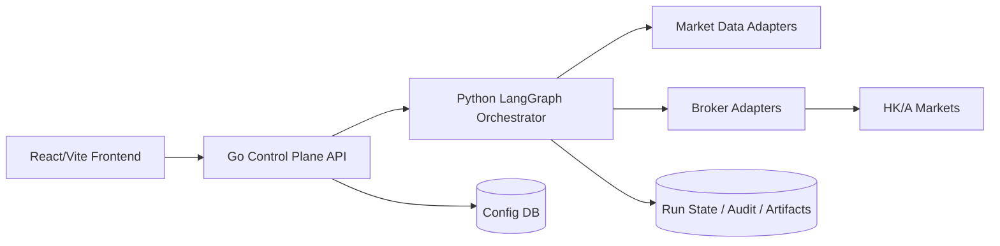

# NOFX 港股/A股 + LangGraph 重构方案

- 文档日期：2026-03-07
- 方案产出目录：`/home/zcxggmu/workspace/hello-projs/AGI-Research/trading/nofx`
- 实际代码仓库：`/home/zcxggmu/workspace/hello-projs/trading/nofx`
- 调研方式：`multi_agent` 并行调研 + 本地代码审计 + LangGraph 官方文档学习

## 1. 目标与约束

### 1.1 本次重构的硬目标

1. **彻底删除加密货币交易支持**，用 **港股 + A股** 交易域替换。
2. 用 **LangGraph** 重构当前“AI 决策/执行编排”能力，形成可恢复、可审计、可流式展示的图工作流。
3. 保留并复用现有项目中可复用的骨架能力：
   - 用户认证
   - 基础配置管理
   - Web 前端视觉骨架
   - 决策日志/统计展示思路
4. 在 `~/.codex/skills` 中新增一个面向本项目的 **LangGraph 重构 skill**，作为后续迭代和协作的标准作业流程。
5. 在最终状态下，系统语义从“crypto exchange / coin / futures / leverage”迁移为“broker / instrument / equity / order policy”。

### 1.2 约束与假设

1. 当前路径仅用于存放方案文档；真实待改造仓库在 `hello-projs/trading/nofx`。
2. 当前仓库后端为 **Go 单体 + Gin + SQLite**，前端为 **React + Vite + TypeScript**。
3. **LangGraph 官方文档（Python 版）** 是本次编排层设计的唯一权威参考。
4. 本轮先输出严谨方案，不直接落代码；实际实现应分阶段推进，先图谱编排与域模型，再删除旧逻辑。
5. 港股/A股的实际券商与行情源需要经过 PoC 与合规评估后最终确定，不在本文件中武断定板，但会给出推荐顺序。

### 1.3 非目标

1. 本轮不讨论“继续保留 crypto 与港/A 双市场并存”。最终目标是 **替换**，不是并行长期共存。
2. 本轮不优先处理“期权/期货/外汇”等其他市场；后续可在 LangGraph 抽象稳定后外扩。
3. 本轮不做“全量重写前端视觉系统”；优先借鉴现有界面与交互骨架，做语义替换与流程升级。

---

## 2. 调研结论摘要

## 2.1 当前项目真实形态

当前 NOFX 实际是一个“**Go 控制/执行后端 + React 前端**”的全栈系统，不是 Python 主体项目。

核心事实：

- 后端入口在 `main.go`，初始化数据库、加密、默认币池、交易员管理器、API 服务、行情 WebSocket。
- 前端在 `web/`，使用 React 18 + Vite + SWR + Zustand。
- API 边界清晰，前端通过 `/api/*` 调后端。
- 当前业务语义深度绑定加密货币永续/交易所模型。

## 2.2 当前“加密货币假设”植入最深的地方

| 模块 | 当前问题 | 对港/A 的影响 |
| --- | --- | --- |
| `trader/*` | 接口默认支持开多/开空/杠杆/逐仓全仓/止盈止损 | 股票交易语义完全不同，必须重写 |
| `market/*` | 深度依赖 Binance Futures、资金费率、OI、USDT 交易对、24/7 WebSocket | 与港股/A股的交易时段、停牌、复权、撮合规则冲突 |
| `decision/engine.go` | prompt 与风控假设写死“BTC/ETH/山寨币/USDT/OI/资金费率” | 必须拆成可组合节点与股票域提示模板 |
| `pool/coin_pool.go` | 币池来自 AI500/OI Top 等加密特有信号 | 需要替换成股票 universe/screener |
| `config/database.go` | `exchanges` 与多交易所钱包/API Key 字段面向 crypto | 必须迁移为券商账户/市场权限/交易通道模型 |
| `web/src/components/traders/ExchangeConfigModal.tsx` | UI 全是交易所、钱包、Agent Wallet 语义 | 应改造成 Broker/Account 配置界面 |
| `web/src/components/TraderConfigModal.tsx` | 交易标的字段仍是 `trading_symbols` 字符串 | 需要升级为 instrument universe / watchlist / board filter |

## 2.3 可复用资产

可复用而不应推倒重来的部分：

1. **认证与用户体系**：`auth/`、JWT、注册/登录流程可延用。
2. **基础配置与 REST 框架**：`api/server.go` 的总体 API 组织方式可保留。
3. **前端布局与图表组件**：
   - `web/src/components/AITradersPage.tsx`
   - `web/src/components/CompetitionPage.tsx`
   - `web/src/components/ComparisonChart.tsx`
   - `web/src/components/EquityChart.tsx`
4. **模型配置能力**：AI 模型配置与 API Key 管理思路可以保留，但要把“决策执行编排”移入 LangGraph。
5. **日志/监控展示习惯**：决策日志、账户、持仓、收益图这些页面形态可保留。

---

## 3. 为什么必须用 LangGraph

基于官方文档，本项目与 LangGraph 的匹配度很高：

1. **这是一个长生命周期、状态驱动、需要失败恢复的交易工作流系统**。
2. LangGraph 官方强调其适用于：
   - long-running / stateful agent workflows
   - streaming
   - subgraphs
   - durable execution
   - memory / persistence
   - human-in-the-loop
3. 对交易系统而言，这些能力直接对应：
   - 交易时段内持续运行
   - 网络/券商异常后的断点恢复
   - 人工审核大额交易或异常订单
   - 实时向前端流式回传执行状态
   - 将“研究 -> 风控 -> 下单 -> 回执 -> 对账”拆为可观察节点

### 3.1 设计原则

本项目不应把 LangGraph 当作“聊天机器人框架”，而应当把它当作：

- **交易编排引擎**
- **状态机**
- **审计链路**
- **节点级故障恢复与回放引擎**

### 3.2 官方文档对本方案的直接启示

1. **Overview**：说明 LangGraph 适合构建可持久化、可中断恢复的 agentic 工作流。
2. **Workflows and agents**：说明应优先把确定性步骤固化为 workflow，把不确定性的 LLM 研究/判断放到受控节点里。
3. **Use subgraphs**：适合把交易流程拆成多个可复用子图。
4. **Streaming**：适合把图运行状态、节点产出、异常信息推给前端。

**官方参考链接：**
- `https://docs.langchain.com/oss/python/langgraph/overview`
- `https://docs.langchain.com/oss/python/langgraph/workflows-agents`
- `https://docs.langchain.com/oss/python/langgraph/use-subgraphs`
- `https://docs.langchain.com/oss/python/langgraph/streaming`

---

## 4. 推荐的总体重构路线

## 4.1 不建议“一步到位全仓重写”

当前系统主体是 Go；LangGraph 主体是 Python。若直接把整个后端一次性重写成 Python，风险极高：

- 同时改语言、改市场、改执行层、改决策层
- 回归面过大
- 难以定位错误来源
- 难以在中途验证业务正确性

## 4.2 推荐路线：Strangler Fig（绞杀式）渐进替换

### 阶段性目标

1. **保留 Go 控制平面**：继续负责认证、用户、配置、前端资源、部分 REST 网关。
2. **新增 Python LangGraph 编排服务**：承接研究、风控、决策、执行编排。
3. **把 crypto 相关执行/行情代码逐步替换为港/A 领域适配器**。
4. **当新链路稳定后，再物理删除 crypto 模块与字段。**

### 推荐目标拓扑



### 角色分工

#### Go Control Plane

保留职责：
- 用户认证
- 基础配置 API
- Broker/Strategy CRUD
- 前端静态资源服务
- 图运行状态查询 API / WebSocket Proxy

#### Python LangGraph Orchestrator

新增职责：
- 图状态定义
- 子图组合
- 研究/决策/执行节点
- checkpoint / resume
- 流式事件输出
- 人工审批中断点
- 节点输入输出审计归档

#### Market Data Adapters

新增职责：
- 标的主数据（instrument master）
- 实时行情 / K 线 / 分时 / 深度
- 公司行为（复权、分红、拆合股）
- 财务与公告补充数据
- 交易日历与交易时段管理

#### Broker Adapters

新增职责：
- 下单/撤单
- 委托查询
- 成交回报
- 持仓/资金查询
- 市场权限 / 做空能力 / 融资融券能力查询

---

## 5. 目标域模型重构

## 5.1 语义替换总表

| 旧语义 | 新语义 | 说明 |
| --- | --- | --- |
| exchange | broker | 从交易所切换到券商/交易通道 |
| trading_symbols | instrument_universe | 由字符串改为结构化标的集 |
| coin pool / oi top | screener / universe builder | 股票筛选来源 |
| leverage | risk policy | 股票策略更多依赖风险预算而非杠杆 |
| API key + wallet | broker credential + account permission | 与股票券商账户结构匹配 |
| futures position | equity position | 需要支持 T+1、lot、撮合、停牌等规则 |

## 5.2 新核心实体

建议新增或替换成以下核心实体：

### `BrokerAccount`

字段建议：
- `id`
- `user_id`
- `broker_type`
- `market_scope`（HK / CN_A / BOTH）
- `account_type`（cash / margin）
- `permissions`（可交易市场、是否支持融资融券、是否支持做空）
- `credential_ref`
- `enabled`

### `Instrument`

字段建议：
- `instrument_id`（建议格式：`HK.00700`、`SH.600519`、`SZ.000001`）
- `market`
- `symbol`
- `name`
- `board`
- `currency`
- `lot_size`
- `price_tick`
- `is_shortable`
- `trade_status`
- `corporate_action_adjustment`

### `StrategyAgent`

替代当前“TraderRecord”的语义：
- `id`
- `name`
- `ai_model_id`
- `broker_account_id`
- `universe_config`
- `risk_policy_id`
- `graph_template`
- `schedule_config`
- `review_mode`
- `enabled`

### `RiskPolicy`

建议包含：
- 单标的最大仓位占比
- 单日最大换手/委托次数
- 单笔风险预算
- 板块/行业集中度限制
- 大额订单审批阈值
- T+1 / 卖出限制 / 做空限制开关
- 开盘集合竞价 / 午间休市 / 收盘前禁买策略

### `GraphRun`

建议包含：
- `run_id`
- `agent_id`
- `graph_name`
- `checkpoint_id`
- `status`
- `started_at`
- `ended_at`
- `stream_channel`
- `error_code`
- `artifact_uri`

---

## 6. LangGraph 目标设计

## 6.1 Graph State 设计原则

建议图状态不要直接沿用现有 `decision.Context`，而要升级成“市场无关 + 股票域增强”的状态结构。

建议状态分层：

1. `RunMetaState`
   - 当前交易日
   - 当前交易时段
   - run_id / checkpoint_id
   - agent_id / user_id
2. `PortfolioState`
   - 现金
   - 持仓
   - 冻结资金
   - 当日买入卖出限制
3. `UniverseState`
   - watchlist
   - screener 输出
   - 当日可交易标的
4. `MarketState`
   - quote
   - kline
   - order book summary
   - sector / index context
   - corporate actions / events
5. `ResearchState`
   - thesis
   - signals
   - llm findings
   - confidence
6. `RiskState`
   - policy checks
   - violations
   - required review
7. `ExecutionState`
   - order intents
   - submitted orders
   - fills / rejects
   - reconciliation results

## 6.2 推荐子图拆分

### 子图 A：`session_gate_subgraph`

职责：
- 判断今天是否交易日
- 判断当前是否处于开盘前/连续竞价/午休/尾盘/盘后
- 决定进入：
  - `research_only`
  - `tradable_session`
  - `shutdown`

### 子图 B：`universe_builder_subgraph`

职责：
- 读取用户 watchlist / 板块偏好
- 结合基础筛选条件构建当日 universe
- 过滤停牌、退市风险、权限不足标的
- 输出当日候选列表

### 子图 C：`market_context_subgraph`

职责：
- 拉取实时行情和 K 线
- 拉取指数/板块上下文
- 拉取公司行为、公告、财务补充信息
- 归一化成统一股票域数据结构

### 子图 D：`research_decision_subgraph`

职责：
- 让 LLM 在结构化上下文上生成“研究结论 + 交易意图候选”
- 强制结构化输出，不允许自由文本直接变订单
- 输出内容至少包括：
  - 标的
  - 动作（buy / sell / reduce / hold / cancel）
  - 目标仓位 / 目标资金占比
  - 证据与风险点
  - 信心等级

### 子图 E：`risk_policy_subgraph`

职责：
- 应用市场规则与账户规则
- 应用策略风险限制
- 标记是否需要人工审批
- 对不合规订单做 deny / resize / defer

### 子图 F：`execution_subgraph`

职责：
- 下单前二次检查
- 生成 broker-specific 请求
- 提交订单
- 跟踪委托回报
- 处理部分成交 / 拒单 / 撤单重试

### 子图 G：`reconcile_archive_subgraph`

职责：
- 同步持仓和资金
- 写入运行工件、节点日志、关键判断理由
- 输出给前端的运行摘要
- 为下一轮 checkpoint 提供恢复点

## 6.3 节点级路由逻辑

建议用 LangGraph 的条件路由表达以下规则：

1. **市场关闭** → 只做 research / watchlist 更新，不下单。
2. **风险违规** → 直接终止执行并写入审计。
3. **需审批** → `interrupt` 等待人工。
4. **订单被拒** → 走 repair/retry 或直接 fail-fast。
5. **行情数据不完整** → fallback 到 hold / defer，而不是继续强行生成订单。

## 6.4 为什么一定要用 Subgraphs

因为本系统天然是多阶段交易流程：

- 会话判断
- 标的筛选
- 数据准备
- LLM 研究
- 风控
- 执行
- 对账

如果全部塞进单一大图：
- 难测试
- 难复用
- 难替换单独环节
- 难给前端做节点级展示

因此建议最小单位是“**主图 + 6~7 个子图**”。

---

## 7. 港股/A股适配方案

## 7.1 不要把“股票市场”简化成“把 BTCUSDT 换成股票代码”

港股/A股与 crypto 最大差异，不在 symbol 命名，而在：

1. **交易日历与时段**
2. **午间休市/集合竞价/尾盘机制**
3. **T+1、最小交易单位、价位档**
4. **停牌、复牌、涨跌停、除权除息、送配拆合**
5. **账户权限与可卖/可买可融可空能力**
6. **委托成交回报不再是“连续 24/7 永续合约”语义**

所以重构重点不是替换接口名，而是 **替换整套市场域模型**。

## 7.2 券商/行情源推荐策略

### 推荐顺序

#### 方案 A：PoC 首选统一通道候选

**Futu OpenAPI / OpenD**

适合原因：
- 官方文档成熟
- 同时具备交易与行情能力
- 更适合作为港股/A股统一 PoC 通道候选

官方参考：
- `https://openapi.futunn.com/futu-api-doc/intro/intro.html`

#### 方案 B：研究/补充数据通道

**AKShare**

适合原因：
- 数据覆盖广，适合做筛选、研究、补充行情与基本面数据抓取
- 适合作为“研究层/补充层”，不建议直接替代交易主通道

官方参考：
- `https://akshare.akfamily.xyz/`

### 建议决策

1. **交易主通道** 与 **研究补充数据通道** 分离设计。
2. 不要让研究层和下单层共用一份“脆弱的单一来源数据”。
3. 生产交易中应以 **券商回报** 和 **交易主通道行情** 作为交易事实来源。
4. 研究层可混用补充数据，但必须在图状态中标明数据源与时间戳。

## 7.3 Broker 适配器接口建议

建议新增统一接口，而不是沿用当前 `Trader` 接口原样扩展。

建议接口语义：

- `GetAccountSnapshot()`
- `GetPositions()`
- `GetTradableUniverse()`
- `GetInstrumentMeta(instrumentID)`
- `SubmitOrder(orderIntent)`
- `CancelOrder(orderID)`
- `GetOrderStatus(orderID)`
- `ListOpenOrders()`
- `GetExecutionFills(runID)`

明确不建议继续保留的旧语义：
- `OpenLong`
- `OpenShort`
- `SetLeverage`
- `SetMarginMode`
- `SetTakeProfit`
- `SetStopLoss`

这些方法是合约交易抽象，不适合作为股票统一接口的核心。

---

## 8. 数据库与配置迁移

## 8.1 核心迁移原则

1. **不要在现有 `exchanges` 表上继续堆字段。**
2. 应新增股票域实体，再将旧表逐步废弃。
3. 在过渡期保留兼容读取层，但新写入全部走新表。

## 8.2 推荐新表

### `broker_accounts`
替代 `exchanges`

### `strategy_agents`
替代当前 `traders`

### `risk_policies`
统一风险约束

### `instrument_lists`
结构化 watchlist / universe 配置

### `graph_runs`
记录 LangGraph 运行实例

### `graph_checkpoints`
记录恢复点

### `order_intents`
记录模型产生的结构化下单意图

### `broker_orders`
记录实际送单与回报

### `portfolio_snapshots`
记录账户与持仓快照

## 8.3 字段级迁移建议

| 旧字段 | 动作 | 新字段/新结构 |
| --- | --- | --- |
| `exchange_id` | 删除语义 | `broker_account_id` |
| `trading_symbols` | 删除字符串形式 | `instrument_list_id` 或 JSON 数组 |
| `btc_eth_leverage` | 删除 | `risk_policy.max_position_pct` |
| `altcoin_leverage` | 删除 | `risk_policy.single_trade_risk_bps` |
| `use_coin_pool` | 删除 | `universe_config.screeners` |
| `use_oi_top` | 删除 | `universe_config.screeners` |
| `hyperliquid_wallet_addr` | 删除 | `broker credential` 子结构 |
| `aster_*` / `lighter_*` | 删除 | `broker credential` 子结构 |
| `is_cross_margin` | 删除或弱化 | `account_type` / `margin_enabled` |

## 8.4 迁移顺序

1. 先建新表。
2. 再做兼容读取层。
3. 前端改为新 API。
4. 最后删旧表/旧字段读写。

---

## 9. 前端重构方案

## 9.1 可以直接借鉴的现有页面/组件

建议优先复用：

1. `web/src/components/AITradersPage.tsx`
   - 作为“策略代理管理页”的骨架
2. `web/src/components/CompetitionPage.tsx`
   - 作为“策略表现/对比页”的视觉基底
3. `web/src/components/ComparisonChart.tsx`
   - 作为收益曲线/策略对比复用组件
4. `web/src/components/EquityChart.tsx`
   - 作为组合净值图复用组件
5. `web/src/components/traders/ExchangeConfigModal.tsx`
   - 改造成 `BrokerConfigModal`
6. `web/src/components/TraderConfigModal.tsx`
   - 改造成 `StrategyAgentConfigModal`

## 9.2 页面语义替换

| 当前页面/概念 | 目标页面/概念 |
| --- | --- |
| AI Trader | Strategy Agent |
| Exchange Config | Broker Account Config |
| Trading Symbols | Universe / Watchlist |
| Coin Pool / OI Top | Screener / Sector / Index Filters |
| Positions | Equity Positions |
| Decisions | Research + Order Intent + Execution Trace |

## 9.3 前端新增页面建议

### `BrokerAccountsPage`
- 券商账户与权限管理

### `UniverseManagerPage`
- 自选股 / 板块 / 筛选条件管理

### `GraphRunsPage`
- 查看 LangGraph 运行记录、节点状态、失败恢复点

### `ApprovalCenterPage`
- 处理需人工审批的交易意图

### `ReplayPage`
- 回放一次图运行：输入、节点输出、执行结果

## 9.4 前端接口改造原则

1. 保持现有 SWR/状态管理模式。
2. 逐步把 `/api/exchanges` 改成 `/api/broker-accounts`。
3. 逐步把 `/api/traders` 改成 `/api/strategy-agents`。
4. 增加 `/api/graph-runs`、`/api/approvals`、`/api/universe`、`/api/order-intents`。
5. 增加实时运行状态通道，用于接收 LangGraph streaming 事件。

---

## 10. Skill 创建方案（`~/.codex/skills`）

## 10.1 目标

新增一个专门服务于 NOFX 改造的技能：

`~/.codex/skills/langgraph-nofx-refactor`

## 10.2 推荐目录结构

```text
~/.codex/skills/langgraph-nofx-refactor/
├── SKILL.md
├── agents/
│   └── openai.yaml
├── references/
│   ├── repo-mapping.md
│   ├── refactor-workflow.md
│   ├── langgraph-patterns.md
│   ├── state-routing-checkpointing.md
│   └── verification-checklist.md
└── scripts/
    ├── scan_graph_candidates.py
    ├── build_migration_matrix.py
    └── validate_refactor_contracts.py
```

## 10.3 `SKILL.md` 应包含的核心内容

1. 何时使用本 skill
2. 如何识别当前模块是否适合迁入 LangGraph
3. 如何从旧代码中提取：
   - state
   - node
   - edge
   - subgraph
   - adapter
4. 如何输出：
   - 迁移矩阵
   - 节点职责表
   - 风险与验证清单
5. 如何在执行改造前检查：
   - 是否混入 crypto 语义
   - 是否遗漏股票市场规则
   - 是否缺少 checkpoint / streaming / interrupt 设计

## 10.4 Skill 交付策略

### V1
- 先交付 `SKILL.md + agents/openai.yaml + references/`

### V2
- 再补 `scripts/`，实现自动扫描与迁移矩阵生成

---

## 11. 分阶段实施计划

## Phase 0：架构定版与 PoC（1 周）

### 目标

确认架构与供应商，不写大规模业务代码。

### 任务

1. 输出 ADR：
   - ADR-001：为什么采用 Go 控制平面 + Python LangGraph 编排
   - ADR-002：券商/行情源选型
   - ADR-003：新域模型定义
2. 用最小 PoC 验证：
   - LangGraph graph skeleton
   - 券商账户连通性
   - 行情拉取
   - 下单模拟/沙盒
3. 定义 `instrument_id` 规范。
4. 定义 Graph State 契约。

### 交付物

- 3 份 ADR
- 1 个 PoC Demo
- GraphState schema 初稿
- provider comparison matrix

### 验收标准

- 能证明至少一个主通道可获取港/A 行情
- 能证明 LangGraph 子图架构可跑通最小流程
- 能明确订单意图到实际券商请求的映射路径

## Phase 1：领域模型与数据库迁移（1~1.5 周）

### 目标

把“crypto 语义数据模型”改成“股票语义数据模型”。

### 任务

1. 新建 `broker_accounts`、`strategy_agents`、`risk_policies` 等表。
2. 引入 `instrument_universe` 结构化配置。
3. 删除/废弃 leverage 与钱包型字段的主路径依赖。
4. 保留只读兼容层，避免一步砍断后台。

### 验收标准

- 新建 agent 不再依赖任何 crypto 专用字段
- 新增 broker account 可表示 HK/A 权限与账户属性
- 新 API 模型不出现 `coin` / `exchange wallet` / `futures leverage` 等语义

## Phase 2：LangGraph Orchestrator 骨架（1 周）

### 目标

搭建 Python 编排服务，不接真实交易也要先跑通图生命周期。

### 任务

1. 新建 `orchestrator/` Python 服务。
2. 定义：
   - state
   - nodes
   - subgraphs
   - persistence/checkpoint
   - streaming
3. 跑通一个最小主图：
   - `load_account`
   - `load_universe`
   - `fetch_market_context`
   - `generate_research`
   - `risk_gate`
   - `archive`
4. 在这一阶段顺手创建 `~/.codex/skills/langgraph-nofx-refactor` 的 V1。

### 验收标准

- 图可运行
- 有 checkpoint
- 有 streaming 事件
- 可记录 run artifact

## Phase 3：Market Data 层替换（1~2 周）

### 目标

把 `market/*` 的 crypto 数据假设替换为股票域模型。

### 任务

1. 新建 `marketdata` 抽象层。
2. 实现：
   - quote adapter
   - candle adapter
   - calendar/session adapter
   - instrument master adapter
   - corporate action adapter
3. 替换资金费率、OI、24/7 WS 等不适用逻辑。
4. 新建统一 market snapshot DTO。

### 验收标准

- 能按交易时段拉取 HK/A 数据
- 能正确表示不可交易时段
- 能对停牌/无权限/无行情做 graceful fallback

## Phase 4：Broker Execution 层替换（1.5~2 周）

### 目标

重写执行抽象，使其服务股票交易。

### 任务

1. 用 `BrokerAdapter` 取代当前 `Trader` 核心接口。
2. 实现 paper adapter。
3. 实现第一个真实 broker adapter。
4. 实现委托/成交/撤单/回报同步。
5. 实现订单规范化与错误码标准化。

### 验收标准

- 支持账户查询、下单、撤单、持仓同步
- 能正确处理部分成交/拒单/撤单
- 风险层能在送单前拦截违规请求

## Phase 5：Research + Risk + Execution Graph 完整化（2 周）

### 目标

完成交易核心主图。

### 任务

1. 完成所有子图。
2. 引入结构化 LLM 输出。
3. 引入 interrupt 审批点。
4. 引入 replayable run artifact。
5. 将旧 `decision/engine.go` 逻辑拆解迁移到多个节点中。

### 验收标准

- 能从市场数据走到结构化 order intent
- 风控可 deny / resize / escalate
- 可人工审批
- 可断点恢复

## Phase 6：前端迁移（1~2 周）

### 目标

让前端完成从 crypto 语义到股票语义的替换，并能展示图运行过程。

### 任务

1. 重命名/重构配置页面。
2. 增加 GraphRuns / ApprovalCenter / Universe 页面。
3. 接入 streaming 状态。
4. 改写图表和字段说明。
5. 移除 wallet / leverage / exchange-specific crypto 表单。

### 验收标准

- 新用户看不到 crypto 专属概念
- 可配置 broker account、strategy agent、universe、risk policy
- 可查看一次 run 的节点轨迹

## Phase 7：Cutover 与删旧（1 周）

### 目标

彻底删除 crypto 支持。

### 任务

1. 删掉 `trader/binance_futures.go` 等 crypto 执行器主路径。
2. 删掉 `pool/coin_pool.go` 及 OI/funding 相关依赖。
3. 删掉前端 crypto 术语与图标。
4. 更新 README、架构文档、部署说明。
5. 迁移完成后再物理删除旧表字段与兼容层。

### 验收标准

- 代码主路径不再出现 crypto 市场交易流程
- 文档与 UI 不再默认表达 crypto 产品形态
- 所有核心 E2E 流程以港股/A股为中心

---

## 12. 模块迁移矩阵（建议）

| 现有模块 | 处理建议 | 目标去向 |
| --- | --- | --- |
| `decision/` | 拆解 | `orchestrator/graphs` + `orchestrator/nodes` |
| `market/` | 重写 | `orchestrator/adapters/marketdata` |
| `trader/` | 重写 | `orchestrator/adapters/brokers` |
| `pool/` | 删除并替换 | `orchestrator/nodes/universe` |
| `manager/trader_manager.go` | 保留外壳，改为调 GraphRun | `Go control plane service` |
| `api/server.go` | 保留 REST 外壳，改资源模型 | `broker/agent/run oriented APIs` |
| `web/src/components/traders/*` | 重命名并语义改造 | `broker / strategy / risk / universe UI` |
| `crypto/`（数据加密） | 保留 | 仍服务敏感配置加密 |

---

## 13. 风险清单

## 13.1 技术风险

1. **语言栈分裂**：Go + Python 并存带来部署复杂度。
2. **规则复杂度高于 crypto**：股票市场规则不是简单的 symbol 替换。
3. **外部通道不稳定**：券商 API、行情源、权限管理、速率限制都可能影响图运行。
4. **结构化输出失败**：LLM 输出如果不严控 schema，会直接污染执行层。
5. **前端语义滞留**：如果只改 API 不改文案/组件名，用户仍会感知为 crypto 产品。

## 13.2 业务风险

1. 港股与 A股可能需要不同券商/不同权限集。
2. 不同市场的订单/撮合/回报模型可能不同。
3. 日内与隔夜、T+1 与持仓可卖规则必须在风控层显式建模。

## 13.3 规避策略

1. 先做 paper adapter。
2. 先做单 broker PoC，再扩多 broker。
3. 先做 research-only graph，再接执行 graph。
4. 用 interrupt 把大额/异常交易卡在人工审批点。
5. 删旧动作放在最后一阶段做，不在 Phase 1~3 提前硬删。

---

## 14. 验证与测试策略

## 14.1 必做测试

1. **域模型单元测试**：instrument、risk policy、calendar、lot size。
2. **Graph 节点测试**：每个 node 输入输出契约固定。
3. **Graph 快照测试**：给定输入时，条件路由与输出可回归。
4. **Broker adapter 集成测试**：沙盒或 mock。
5. **Market data 合同测试**：字段完整性、时间戳、市场状态。
6. **前端接口契约测试**：新资源模型不再泄露 crypto 字段。
7. **E2E paper trading 测试**：完整跑通一次交易日流程。

## 14.2 Done Definition

满足以下条件才能声称“港/A LangGraph 重构完成”：

1. 新 agent 可配置 broker、universe、risk policy。
2. LangGraph 主图可持续运行、可 checkpoint、可 streaming、可 replay。
3. 能完成至少一个真实或模拟的股票市场下单闭环。
4. 前后端主路径不再使用 crypto 概念。
5. crypto 主路径代码已删除或完全失效。

---

## 15. 建议的首批里程碑任务（可直接拆 issue）

1. `ADR-001`：确定 Go control plane + Python LangGraph 双服务架构。
2. `ADR-002`：完成 Futu / AKShare PoC 对比。
3. 设计 `instrument_id` 与 `BrokerAccount` schema。
4. 新建 `strategy_agents` / `broker_accounts` / `graph_runs` 表。
5. 新建 `orchestrator/` Python 服务骨架。
6. 实现 `session_gate_subgraph`。
7. 实现 `universe_builder_subgraph`。
8. 实现 `market_context_subgraph`。
9. 实现 `risk_policy_subgraph`。
10. 创建 `~/.codex/skills/langgraph-nofx-refactor` V1。
11. 将前端 `ExchangeConfigModal` 改造为 `BrokerConfigModal` 设计稿。
12. 将前端 `TraderConfigModal` 改造为 `StrategyAgentConfigModal` 设计稿。
13. 设计 streaming 事件协议。
14. 定义 `order_intent` JSON schema。
15. 准备 crypto 删除清单与最终 cutover checklist。

---

## 16. 最终建议

### 建议结论

**推荐采用：Go 控制平面保留 + Python LangGraph 编排层新增 + 港/A 领域模型重建 + 最后删旧 crypto 主路径**。

这是当前风险最低、可验证性最高、同时满足“删除 crypto + 引入 LangGraph + 保留前端可借鉴资产”三项要求的方案。

### 不推荐的路线

1. 不推荐“直接把 Go 后端全部推倒重写成 Python”。
2. 不推荐“保留 futures 语义，只把 symbol 换成股票代码”。
3. 不推荐“先删 crypto 再设计新域模型”。正确顺序应是：**先建新链路，后删旧链路**。

### 下一步最合理动作

1. 先做 **Phase 0 PoC**。
2. 同时产出 `langgraph-nofx-refactor` skill V1。
3. 确认券商/行情源后，再进入数据库与 graph skeleton 实装。

---

## 17. 参考资料

### 官方文档
- LangGraph Overview: `https://docs.langchain.com/oss/python/langgraph/overview`
- LangGraph Workflows and agents: `https://docs.langchain.com/oss/python/langgraph/workflows-agents`
- LangGraph Use subgraphs: `https://docs.langchain.com/oss/python/langgraph/use-subgraphs`
- LangGraph Streaming: `https://docs.langchain.com/oss/python/langgraph/streaming`
- Futu OpenAPI Intro: `https://openapi.futunn.com/futu-api-doc/intro/intro.html`
- AKShare 文档: `https://akshare.akfamily.xyz/`

### 本地调研重点文件
- `main.go`
- `api/server.go`
- `config/database.go`
- `decision/engine.go`
- `market/data.go`
- `manager/trader_manager.go`
- `trader/interface.go`
- `trader/auto_trader.go`
- `web/src/components/AITradersPage.tsx`
- `web/src/components/CompetitionPage.tsx`
- `web/src/components/ComparisonChart.tsx`
- `web/src/components/EquityChart.tsx`
- `web/src/components/traders/ExchangeConfigModal.tsx`
- `web/src/components/TraderConfigModal.tsx`

