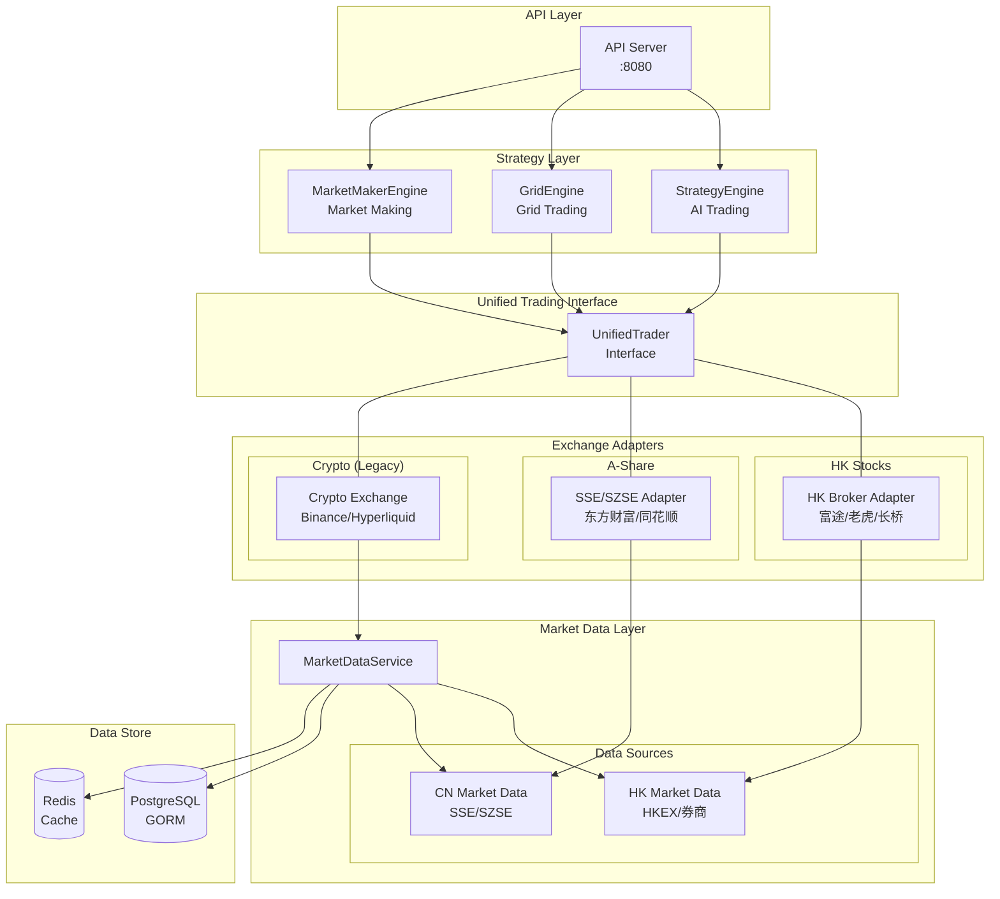

# NOFX 港A股交易系统架构设计

## 1. 概述

### 1.1 背景

基于现有的加密货币交易系统 (NOFX) 架构，设计港股和A股交易系统的目标架构。该架构需要：

- 保留现有网格交易、做市商等策略的兼容性
- 支持港股券商API和A股交易所接口
- 适配A股T+1交易制度
- 支持港股涡轮、牛熊证等衍生品

### 1.2 设计原则

| 原则 | 描述 |
|------|------|
| 模块化 | 接口与实现分离，支持多数据源、多券商 |
| 可扩展性 | 新增市场/券商只需实现接口 |
| 兼容性 | 保留现有策略接口，统一交易上下文 |
| 规范化 | 订单、持仓数据结构标准化 |

---

## 2. 系统架构

### 2.1 整体架构图



### 2.2 目录结构

```
nofx/
├── docs/refactor/ARCHITECTURE.md
├── trader/types/
│   ├── interface.go             # 统一Trader接口
│   ├── hk_interface.go         # 港股Trader接口扩展
│   ├── cn_interface.go         # A股Trader接口扩展
│   └── types.go                 # 通用类型定义
├── adapter/
│   ├── hk/futu/                # 富途券商适配器
│   ├── hk/tiger/               # 老虎证券适配器
│   ├── hk/longbridge/          # 长桥证券适配器
│   ├── cn/eastmoney/           # 东方财富API适配器
│   └── cn/ths/                 # 同花顺API适配器
├── market/
│   ├── hk_market.go            # 港股市场数据
│   └── cn_market.go            # A股市场数据
├── store/
│   ├── hk_position.go          # 港股持仓扩展
│   ├── hk_order.go             # 港股订单扩展
│   ├── cn_position.go          # A股持仓扩展
│   ├── cn_order.go             # A股订单扩展
│   └── cn_trade.go             # A股成交存储
└── kernel/
    ├── t1_manager.go           # T+1管理器
    ├── hk_strategy.go          # 港股策略
    └── cn_strategy.go          # A股策略
```

---

## 3. 接口设计

### 3.1 统一Trader接口

```go
// MarketType 市场类型
type MarketType string

const (
    MarketTypeCrypto MarketType = "crypto"  // 加密货币
    MarketTypeHK     MarketType = "hk"      // 港股
    MarketTypeCN     MarketType = "cn"      // A股
)

// Trader 统一交易接口
type Trader interface {
    GetMarketType() MarketType
    GetBalance() (*AccountBalance, error)
    GetPositions() ([]*Position, error)
    PlaceOrder(req *PlaceOrderRequest) (*OrderResult, error)
    CancelOrder(orderID string) error
    GetOrderStatus(orderID string) (*OrderStatus, error)
    GetMarketData(symbol string) (*MarketData, error)
    FormatQuantity(symbol string, quantity float64) (string, error)
}

// AccountBalance 账户余额
type AccountBalance struct {
    MarketType    MarketType
    TotalEquity   float64  // 总权益
    AvailableCash float64  // 可用资金
    FrozenCash    float64  // 冻结资金
    MarketValue   float64  // 持仓市值
    TotalAsset    float64  // 总资产
    Currency      string   // 币种
}

// Position 持仓信息
type Position struct {
    Symbol          string  // 股票代码
    Name            string  // 股票名称
    Quantity        float64 // 持股数量
    AvailableQty    float64 // 可用数量 (T+1限制)
    AvgCost         float64 // 平均成本
    CurrentPrice    float64 // 当前价格
    MarketValue     float64 // 市值
    UnrealizedPnL   float64 // 浮动盈亏
    UnrealizedPnLPct float64
    Side            string  // "long" (A股只能做多)
    Status          string  // "OPEN", "FROZEN"
}
```

### 3.2 港股Trader接口扩展

```go
type HKTrader interface {
    Trader
    GetHKPositions() ([]*HKPosition, error)
    PlaceHKOrder(req *HKOrderRequest) (*HKOrderResult, error)
    GetHKMarketData(symbol string) (*HKMarketData, error)
    GetHKWarrantData(symbol string) ([]*WarrantData, error)
}

type HKPosition struct {
    Position
    Exchange       string  // 交易所 (SEHK)
    Board          string  // 板块 (Main, GEM, Warrant)
    LotSize        int     // 每手股数
    IsWarrant      bool    // 是否涡轮
    IsCBBC         bool    // 是否牛熊证
}

type WarrantData struct {
    Symbol            string  // 涡轮代码
    Type              string  // "CALL", "PUT"
    Issuer            string  // 发行商
    StrikePrice       float64 // 行权价
    MaturityDate       string  // 到期日
    Premium            float64 // 溢价
    EffectiveLeverage  float64 // 有效杠杆
    Delta              float64 // 对冲值
}
```

### 3.3 A股Trader接口扩展

```go
type CNTrader interface {
    Trader
    GetCNPositions() ([]*CNPosition, error)
    PlaceCNOrder(req *CNOrderRequest) (*CNOrderResult, error)
    GetCNMarketData(symbol string) (*CNMarketData, error)
    GetCNAccountInfo() (*CNAccountInfo, error)
    CheckT1Status(symbol string, quantity float64) (float64, error)
}

type CNPosition struct {
    Position
    Exchange      string  // 交易所 (SSE, SZSE, BSE)
    Board         string  // 板块 (Main, STAR, BJSE)
    FrozenQty     float64 // 冻结数量 (T+1)
    TradingLimit  float64 // 涨跌停限制
}

type CNAccountInfo struct {
    AccountBalance
    MarginUsed      float64 // 融资占用
    MarginAvailable float64 // 融资可用
    ShortUsed       float64 // 融券占用
    ShortAvailable  float64 // 融券可用
}
```

---

## 4. 数据层设计

### 4.1 T+1 交易限制处理

```go
// T1Manager T+1交易管理器
type T1Manager struct {
    db            *gorm.DB
    tradeStore    *CNTradeStore
    positionStore *CNPositionStore
}

// AllowedSellQty 计算允许卖出数量
func (m *T1Manager) AllowedSellQty(traderID, symbol string) (float64, error) {
    // 今日买入不可卖，昨日买入可卖
    todayBuys, err := m.tradeStore.GetTodayBuys(traderID, symbol)
    olderPositions, err := m.positionStore.GetTradablePositions(traderID, symbol)
    // ...
}

// OnTradeExecute 成交后更新T+1状态
func (m *T1Manager) OnTradeExecute(trade *CNTrade) error {
    if trade.Side == "BUY" {
        return m.freezeForT1(trade)  // 买入冻结
    }
    return m.unfreezeForT1(trade)    // 卖出解冻
}

// OnTradingDayEnd 日终解冻昨日买入
func (m *T1Manager) OnTradingDayEnd(traderID string) error {
    return m.positionStore.UnfreezeYesterdayBuys(traderID)
}
```

### 4.2 数据库模型

```go
// store/hk_position.go
type HKStockPosition struct {
    ID                int64   `gorm:"primaryKey"`
    TraderID          string  `gorm:"index"`
    ExchangeID        string
    Symbol            string  // "00700"
    Name              string
    Quantity          float64
    AvailableQty      float64
    FrozenQty         float64
    AvgCost           float64
    ExchangePositionID string
    Currency          string
}

// store/cn_position.go
type CNStockPosition struct {
    ID                int64   `gorm:"primaryKey"`
    TraderID          string  `gorm:"index"`
    ExchangeID        string
    Symbol            string  // "600519"
    Exchange          string  // SSE/SZSE/BSE
    AccountID         string
}

type CNTrade struct {
    ID                int64   `gorm:"primaryKey"`
    OrderID           int64
    ExchangeTradeID   string  `gorm:"uniqueIndex"`
    Symbol            string
    Side              string
    Price             float64
    Quantity           float64
    Amount            float64
    Commission        float64
    SettlementDate    int64   // T+1结算日期
    TradeDate         int64
}
```

---

## 5. 市场数据层设计

### 5.1 港股行情数据方案

| 数据源 | 延迟 | 成本 | 可靠性 | 涡轮数据 |
|--------|------|------|--------|----------|
| 富途API | ~100ms | 免费 | 高 | 支持 |
| 老虎API | ~200ms | 免费 | 高 | 不支持 |
| 长桥API | ~100ms | 免费 | 高 | 支持 |
| HKEX Orion | ~500ms | 收费 | 极高 | 不支持 |

**推荐方案**: 以券商API为主数据源，HKEX为备份

### 5.2 A股行情数据方案

| 数据源 | 延迟 | 成本 | 可靠性 | Level2 |
|--------|------|------|--------|--------|
| 东方财富 | ~500ms | 免费 | 高 | 不支持 |
| 同花顺iFinD | ~200ms | 收费 | 极高 | 支持 |
| 聚宽 | ~1s | 免费 | 中 | 不支持 |

**推荐方案**: 东方财富(免费)、同花顺(付费Level2)

---

## 6. 券商适配器实现

### 6.1 富途港股适配器

```go
type FutuTrader struct {
    client   *futu.FutuClient
    config   *TraderConfig
    marketDS *HKMarketDataService
}

func NewFutuTrader(cfg *TraderConfig) (*FutuTrader, error) {
    client, err := futu.NewClient(cfg.APIKey, cfg.SecretKey)
    return &FutuTrader{client: client, config: cfg}, err
}

func (t *FutuTrader) GetMarketType() MarketType { return MarketTypeHK }
func (t *FutuTrader) GetBalance() (*AccountBalance, error) { /*...*/ }
func (t *FutuTrader) GetPositions() ([]*Position, error) { /*...*/ }
func (t *FutuTrader) PlaceOrder(req *PlaceOrderRequest) (*OrderResult, error) { /*...*/ }
```

### 6.2 东方财富A股适配器

```go
type EastMoneyTrader struct {
    client   *eastmoney.Client
    config   *TraderConfig
    marketDS *CNMarketDataService
    t1Mgr    *T1Manager
}

func (t *EastMoneyTrader) GetMarketType() MarketType { return MarketTypeCN }
func (t *EastMoneyTrader) PlaceOrder(req *PlaceOrderRequest) (*OrderResult, error) {
    // 检查T+1限制
    if req.Side == "SELL" {
        allowedQty, err := t.t1Mgr.AllowedSellQty(t.config.TraderID, req.Symbol)
        if err != nil { return nil, err }
        if req.Quantity > allowedQty {
            return nil, fmt.Errorf("T+1限制: 允许卖出 %.2f, 请求 %.2f", allowedQty, req.Quantity)
        }
    }
    // ...
}
```

---

## 7. 网格交易适配

```go
// GridContextHK 港股网格上下文
type GridContextHK struct {
    GridContext
    Exchange       string
    Currency       string
    CommissionRate float64  // 佣金0.03%
    PlatformFee   float64  // 平台费15港币
    StampDuty     float64  // 印花税0.1%
}

// GridContextCN A股网格上下文
type GridContextCN struct {
    GridContext
    Exchange      string
    T1Manager     *T1Manager
    CommissionRate float64
    StampDuty     float64
}

func BuildGridContextCN(trader CNTrader, config *GridStrategyConfigCN) (*GridContextCN, error) {
    // T+1检查
    t1Manager := NewT1Manager(db, tradeStore, positionStore)
    allowedQty, err := t1Mgr.AllowedSellQty(traderID, config.Symbol)
    // ...
}
```

---

## 8. 关键设计决策

### ADR-001: 使用统一Trader接口

- 策略层代码统一，便于市场间迁移
- 适配器模式便于扩展新券商
- 缺点: 某些市场特有功能需要类型断言

### ADR-002: T+1交易限制在应用层处理

- 不依赖券商API的T+1校验
- 便于统一管理和监控
- 需要日终任务解冻持仓

### ADR-003: 港股行情以券商API为主

- 延迟低 (~100ms)、免费、涡轮数据支持
- 依赖券商服务稳定性

---

## 9. 实施计划

### Phase 1: 接口定义
1. 定义统一Trader接口
2. 定义港股/港股Trader接口
3. 定义通用类型

### Phase 2: 数据层
1. 实现港股/港股持仓订单存储
2. 实现T+1管理器
3. 实现行情缓存

### Phase 3: 市场数据
1. 实现港股行情服务 (富途适配)
2. 实现A股行情服务 (东方财富适配)

### Phase 4: 交易引擎
1. 扩展策略引擎支持港A股
2. 扩展网格引擎支持港A股

### Phase 5: 券商适配器
1. 富途/老虎/长桥港股适配器
2. 东方财富/同花顺A股适配器

---

## 10. 风险与限制

| 风险 | 影响 | 缓解措施 |
|------|------|----------|
| 券商API限制 | 高 | 多券商备份，限流控制 |
| T+1制度复杂性 | 中 | 独立T1Manager管理 |
| 港股涡轮复杂性 | 中 | 可选功能，后期实现 |
| A股Level2数据成本 | 低 | 使用基础数据起步 |

**当前限制**:
- 暂不支持融资融券
- 暂不支持期权
- 港股涡轮/牛熊证为可选功能
- 美股交易未规划
