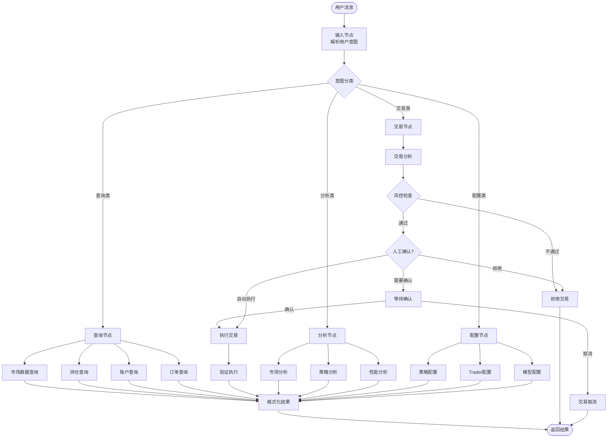
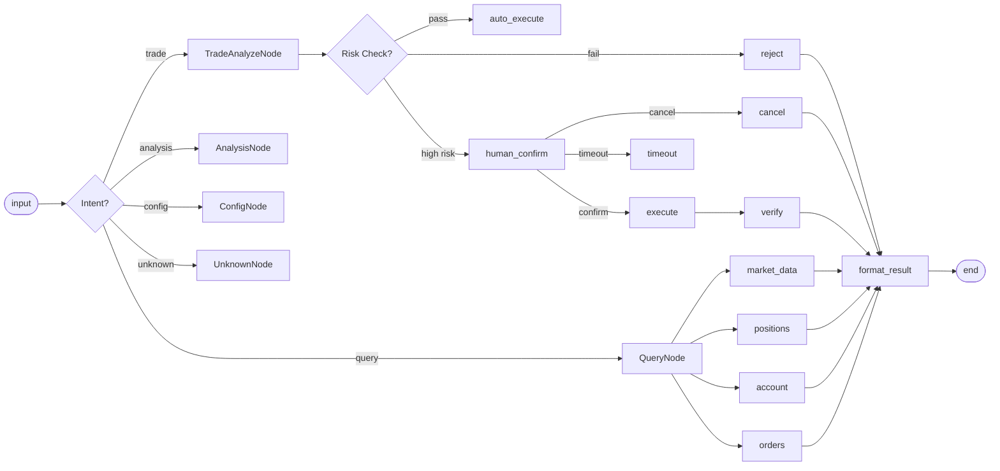
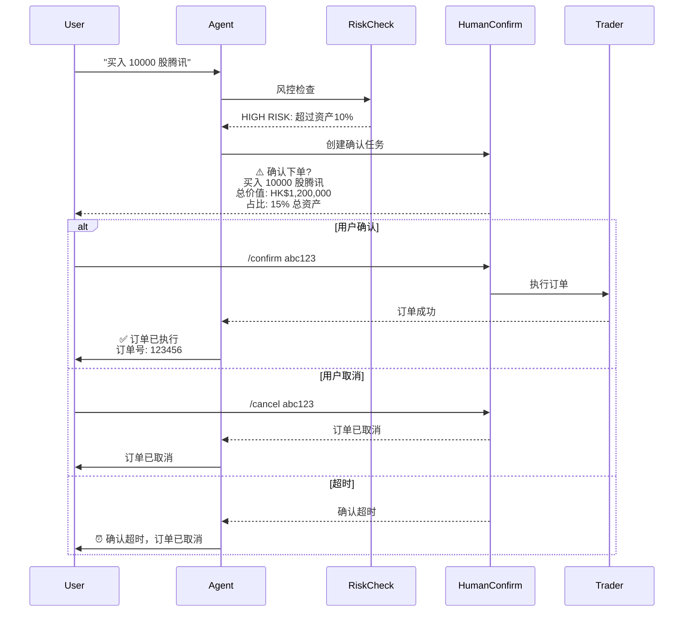

# NOFX LangGraph Agent 重构设计方案

## 1. 概述

### 1.1 重构背景

现有 `telegram/agent/` 实现是一个简单的 LLM 循环调用架构：
- 单一工具 `api_request`
- 最多 10 次迭代
- 无状态管理
- 无 Human-in-the-loop

### 1.2 重构目标

使用 LangGraph 重构为：
- **状态化的工作流**：每个步骤的状态显式管理
- **模块化节点**：市场数据、分析、风控、执行分离
- **条件路由**：基于状态动态选择下一步
- **Human-in-the-loop**：关键操作需人工确认
- **多工具支持**：细粒度的工具定义

---

## 2. LangGraph 架构

### 2.1 整体架构图



### 2.2 状态定义

```go
// TradingState LangGraph 的核心状态
type TradingState struct {
    // 对话上下文
    ThreadID     string             // 对话线程 ID
    UserID       string             // 用户 ID
    UserMessage  string             // 用户原始消息
    Intent       IntentType         // 识别的意图
    Messages     []Message          // 对话历史

    // 账户上下文
    Account      *AccountContext    // 账户信息快照
    Traders      []*TraderSummary   // Trader 列表
    Models       []*ModelSummary     // AI 模型列表

    // 交易上下文
    CurrentTask  *TaskContext       // 当前任务
    MarketData   *MarketDataCache   // 市场数据缓存
    Positions    []*Position        // 当前持仓
    PendingOrder *OrderRequest      // 待执行订单

    // 工作流状态
    WorkflowStep  WorkflowStep      // 当前工作流步骤
    RiskResult   *RiskResult       // 风控结果
    HumanAction  *HumanAction      // 人工操作状态
    Error        *StateError       // 错误信息
}

// IntentType 意图类型
type IntentType string

const (
    IntentQuery    IntentType = "query"    // 查询类
    IntentTrade    IntentType = "trade"    // 交易类
    IntentAnalysis IntentType = "analysis"  // 分析类
    IntentConfig   IntentType = "config"   // 配置类
    IntentUnknown  IntentType = "unknown"  // 未知
)

// WorkflowStep 工作流步骤
type WorkflowStep string

const (
    StepStart         WorkflowStep = "start"
    StepIntentRouting WorkflowStep = "intent_routing"
    StepQueryProcess  WorkflowStep = "query_process"
    StepTradeAnalyze WorkflowStep = "trade_analyze"
    StepRiskCheck    WorkflowStep = "risk_check"
    StepHumanConfirm WorkflowStep = "human_confirm"
    StepOrderExecute WorkflowStep = "order_execute"
    StepVerification  WorkflowStep = "verification"
    StepFormatResult WorkflowStep = "format_result"
    StepEnd          WorkflowStep = "end"
    StepError        WorkflowStep = "error"
)

// Message 消息结构
type Message struct {
    Role    string    // "user", "assistant", "tool", "system"
    Content string    // 消息内容
    ToolCall *ToolCall // 工具调用
    Time    time.Time // 时间戳
}

// ToolCall 工具调用
type ToolCall struct {
    ID       string
    Name     string
    Args     map[string]any
    Result   string // 执行结果
}

// AccountContext 账户上下文
type AccountContext struct {
    UserEmail    string
    UserID       string
    TotalAsset   float64
    AvailableCash float64
    MarketValue  float64
    TotalPnL     float64
    DailyPnL     float64
}

// Position 持仓信息
type Position struct {
    TraderID     string
    TraderName   string
    Symbol       string
    Name         string
    Quantity     float64
    AvailableQty  float64
    AvgCost      float64
    CurrentPrice float64
    UnrealizedPnL float64
    Side         string
}

// OrderRequest 订单请求
type OrderRequest struct {
    TraderID    string
    Symbol      string
    Side        string  // "BUY" / "SELL"
    Quantity    float64
    OrderType   string  // "MARKET" / "LIMIT"
    LimitPrice  float64
    MarketType  string  // "hk" / "cn" / "crypto"
}

// RiskResult 风控结果
type RiskResult struct {
    Passed      bool
    RiskLevel   string  // "LOW" / "MEDIUM" / "HIGH" / "CRITICAL"
    Reasons     []string
    Suggestions []string
}

// HumanAction 人工操作状态
type HumanAction struct {
    ActionType   string    // "order_confirm" / "cancel_confirm"
    Details      string    // 操作详情
    CreatedAt    time.Time
    ExpiresAt    time.Time
    Confirmed    *bool     // nil = pending, true = confirmed, false = rejected
    ConfirmToken string    // 确认 token
}
```

---

## 3. 节点设计

### 3.1 核心节点

| 节点名称 | 功能 | 输入 | 输出 |
|---------|------|------|------|
| `input_node` | 解析用户消息，构建初始状态 | 用户消息 | TradingState |
| `intent_node` | LLM 识别用户意图 | 用户消息 + 账户上下文 | IntentType |
| `query_node` | 处理查询请求 | Intent + 查询类型 | 查询结果 |
| `market_data_node` | 获取市场数据 | Symbol | MarketData |
| `analysis_node` | 市场/策略分析 | MarketData + Positions | AnalysisResult |
| `signal_node` | 生成交易信号 | AnalysisResult | Signal |
| `risk_check_node` | 风控检查 | Signal + Account | RiskResult |
| `human_confirm_node` | 请求人工确认 | OrderRequest | HumanAction |
| `execution_node` | 执行交易 | OrderRequest | ExecutionResult |
| `verification_node` | 验证执行结果 | ExecutionResult | VerificationResult |
| `format_result_node` | 格式化输出 | 任意结果 | 格式化文本 |

### 3.2 节点详细定义

```go
// input_node: 解析用户输入
func InputNode(state *TradingState) (*TradingState, error) {
    state.UserMessage = state.UserMessage
    state.WorkflowStep = StepIntentRouting
    state.CurrentTask = &TaskContext{
        CreatedAt: time.Now(),
    }
    return state, nil
}

// intent_node: 使用 LLM 识别意图
func IntentNode(state *TradingState) (*TradingState, error) {
    prompt := fmt.Sprintf(`分析用户消息，识别意图类型。

用户消息: %s

可选意图:
- query: 查询账户、持仓、行情、订单等
- trade: 买入、卖出、止损等交易操作
- analysis: 市场分析、策略分析、性能分析
- config: 策略配置、模型配置等
- unknown: 无法识别

返回 JSON: {"intent": "意图类型", "entities": {"key": "value"}}`, state.UserMessage)

    response, err := llm.Call(prompt)
    if err != nil {
        return nil, err
    }

    var intentResult IntentResult
    json.Unmarshal(response, &intentResult)
    state.Intent = IntentType(intentResult.Intent)
    state.CurrentTask.Entities = intentResult.Entities

    return state, nil
}

// market_data_node: 获取市场数据
func MarketDataNode(state *TradingState) (*TradingState, error) {
    symbol := state.CurrentTask.Entities["symbol"]
    if symbol == "" {
        return state, fmt.Errorf("symbol is required")
    }

    marketData, err := getMarketData(symbol)
    if err != nil {
        return nil, err
    }
    state.MarketData = marketData

    return state, nil
}

// risk_check_node: 风控检查
func RiskCheckNode(state *TradingState) (*TradingState, error) {
    order := state.PendingOrder
    account := state.Account

    // 计算风险指标
    riskResult := &RiskResult{
        Passed: true,
        RiskLevel: "LOW",
        Reasons: []string{},
        Suggestions: []string{},
    }

    // 1. 资金检查
    requiredCash := order.Quantity * order.LimitPrice
    if order.Side == "BUY" && requiredCash > account.AvailableCash {
        riskResult.Passed = false
        riskResult.RiskLevel = "HIGH"
        riskResult.Reasons = append(riskResult.Reasons, "资金不足")
        riskResult.Suggestions = append(riskResult.Suggestions, fmt.Sprintf("需要 %.2f，可用 %.2f", requiredCash, account.AvailableCash))
    }

    // 2. 持仓限制检查 (T+1 for A-share)
    if order.MarketType == "cn" && order.Side == "SELL" {
        allowedQty, err := t1Manager.AllowedSellQty(state.UserID, order.Symbol)
        if err != nil {
            riskResult.Passed = false
            riskResult.Reasons = append(riskResult.Reasons, fmt.Sprintf("T+1检查失败: %v", err))
        } else if order.Quantity > allowedQty {
            riskResult.Passed = false
            riskResult.RiskLevel = "MEDIUM"
            riskResult.Reasons = append(riskResult.Reasons, fmt.Sprintf("T+1限制: 允许卖出 %.2f", allowedQty))
            riskResult.Suggestions = append(riskResult.Suggestions, "请等待持仓解冻后再次尝试")
        }
    }

    // 3. 仓位检查
    for _, pos := range state.Positions {
        if pos.Symbol == order.Symbol {
            if order.Side == "BUY" && pos.UnrealizedPnL < -0.1 {
                riskResult.RiskLevel = "MEDIUM"
                riskResult.Reasons = append(riskResult.Reasons, "持仓浮亏超过 10%")
                riskResult.Suggestions = append(riskResult.Suggestions, "建议先平仓或止损")
            }
        }
    }

    // 4. 单笔限额检查
    if order.Quantity > 100000 {
        riskResult.RiskLevel = "HIGH"
        riskResult.Reasons = append(riskResult.Reasons, "单笔数量超过限额")
    }

    state.RiskResult = riskResult
    return state, nil
}

// human_confirm_node: 请求人工确认
func HumanConfirmNode(state *TradingState) (*TradingState, error) {
    order := state.PendingOrder

    // 判断是否需要人工确认
    autoConfirm := shouldAutoConfirm(order, state.Account)

    if autoConfirm {
        // 小额订单自动执行
        return state, nil
    }

    // 创建人工确认任务
    state.HumanAction = &HumanAction{
        ActionType: "order_confirm",
        Details:    fmt.Sprintf("%s %s %.2f 股 @ %.2f", order.Side, order.Symbol, order.Quantity, order.LimitPrice),
        CreatedAt:  time.Now(),
        ExpiresAt:  time.Now().Add(5 * time.Minute),
    }

    state.WorkflowStep = StepHumanConfirm
    return state, nil
}

// execution_node: 执行交易
func ExecutionNode(state *TradingState) (*TradingState, error) {
    order := state.PendingOrder

    // 调用 Trader 执行订单
    result, err := trader.PlaceOrder(order)
    if err != nil {
        return nil, fmt.Errorf("order execution failed: %v", err)
    }

    state.CurrentTask.ExecutionResult = result
    return state, nil
}
```

---

## 4. 边 (Edges) 设计

### 4.1 边定义

```go
// 条件边路由函数
func RouteByIntent(state *TradingState) string {
    switch state.Intent {
    case IntentQuery:
        return "query"
    case IntentTrade:
        return "trade"
    case IntentAnalysis:
        return "analysis"
    case IntentConfig:
        return "config"
    default:
        return "unknown"
    }
}

func RouteByRiskCheck(state *TradingState) string {
    if !state.RiskResult.Passed {
        return "reject"
    }
    if state.RiskResult.RiskLevel == "HIGH" || state.RiskResult.RiskLevel == "CRITICAL" {
        return "human_confirm"
    }
    return "auto_execute"
}

func RouteByHumanAction(state *TradingState) string {
    if state.HumanAction == nil {
        return "execute"
    }
    switch *state.HumanAction.Confirmed {
    case true:
        return "execute"
    case false:
        return "cancel"
    }
    return "await"
}

func RouteByQueryType(state *TradingState) string {
    queryType := state.CurrentTask.Entities["query_type"]
    return queryType
}
```

### 4.2 边图



---

## 5. 工具 (Tools) 设计

### 5.1 工具列表

```go
// ToolDefinition 工具定义
type ToolDefinition struct {
    Name        string
    Description string
    Parameters  map[string]any
}

// AvailableTools 可用工具列表
var AvailableTools = []ToolDefinition{
    // 市场数据工具
    {
        Name: "get_market_data",
        Description: "获取指定股票的实时行情数据",
        Parameters: map[string]any{
            "type": "object",
            "properties": map[string]any{
                "symbol": map[string]any{"type": "string", "description": "股票代码，如 '00700' (港股) 或 '600519' (A股)"},
                "market": map[string]any{"type": "string", "enum": []string{"hk", "cn"}, "description": "市场类型"},
            },
            "required": []string{"symbol", "market"},
        },
    },
    {
        Name: "get_realtime_quote",
        Description: "获取多个股票的实时报价",
        Parameters: map[string]any{
            "type": "object",
            "properties": map[string]any{
                "symbols": map[string]any{"type": "array", "items": map[string]any{"type": "string"}, "description": "股票代码列表"},
            },
            "required": []string{"symbols"},
        },
    },

    // 账户工具
    {
        Name: "get_account_info",
        Description: "获取账户余额和资产信息",
        Parameters: map[string]any{
            "type": "object",
            "properties": map[string]any{
                "trader_id": map[string]any{"type": "string"},
            },
        },
    },
    {
        Name: "get_positions",
        Description: "获取当前持仓列表",
        Parameters: map[string]any{
            "type": "object",
            "properties": map[string]any{
                "trader_id": map[string]any{"type": "string"},
                "symbol": map[string]any{"type": "string", "description": "可选，筛选特定股票"},
            },
        },
    },

    // 订单工具
    {
        Name: "place_order",
        Description: "下单交易",
        Parameters: map[string]any{
            "type": "object",
            "properties": map[string]any{
                "trader_id": map[string]any{"type": "string"},
                "symbol": map[string]any{"type": "string"},
                "side": map[string]any{"type": "string", "enum": []string{"BUY", "SELL"}},
                "quantity": map[string]any{"type": "number"},
                "order_type": map[string]any{"type": "string", "enum": []string{"MARKET", "LIMIT"}},
                "price": map[string]any{"type": "number", "description": "限价单价格"},
            },
            "required": []string{"trader_id", "symbol", "side", "quantity"},
        },
    },
    {
        Name: "cancel_order",
        Description: "撤单",
        Parameters: map[string]any{
            "type": "object",
            "properties": map[string]any{
                "trader_id": map[string]any{"type": "string"},
                "order_id": map[string]any{"type": "string"},
            },
            "required": []string{"trader_id", "order_id"},
        },
    },
    {
        Name: "get_order_status",
        Description: "查询订单状态",
        Parameters: map[string]any{
            "type": "object",
            "properties": map[string]any{
                "trader_id": map[string]any{"type": "string"},
                "order_id": map[string]any{"type": "string"},
            },
            "required": []string{"trader_id", "order_id"},
        },
    },

    // 分析工具
    {
        Name: "calculate_risk",
        Description: "计算交易风险指标",
        Parameters: map[string]any{
            "type": "object",
            "properties": map[string]any{
                "trader_id": map[string]any{"type": "string"},
                "symbol": map[string]any{"type": "string"},
                "side": map[string]any{"type": "string"},
                "quantity": map[string]any{"type": "number"},
            },
            "required": []string{"trader_id", "symbol", "side", "quantity"},
        },
    },
    {
        Name: "get_historical_data",
        Description: "获取历史K线数据",
        Parameters: map[string]any{
            "type": "object",
            "properties": map[string]any{
                "symbol": map[string]any{"type": "string"},
                "market": map[string]any{"type": "string"},
                "interval": map[string]any{"type": "string", "description": "K线周期: 1m, 5m, 1h, 1d"},
                "limit": map[string]any{"type": "integer", "description": "数据条数"},
            },
            "required": []string{"symbol", "market", "interval", "limit"},
        },
    },
}
```

---

## 6. Human-in-the-loop 设计

### 6.1 确认场景

```go
// shouldAutoConfirm 判断是否需要人工确认
func shouldAutoConfirm(order *OrderRequest, account *AccountContext) bool {
    // 大额订单需要确认
    orderValue := order.Quantity * order.LimitPrice
    if orderValue > account.TotalAsset*0.1 {
        return false // 超过总资产 10% 需要确认
    }

    // 高风险持仓加仓需要确认
    for _, pos := range account.Positions {
        if pos.Symbol == order.Symbol && pos.UnrealizedPnL < -0.05 {
            return false // 浮亏超过 5% 加仓需要确认
        }
    }

    // 卖空需要确认
    if order.Side == "SELL" {
        hasPosition := false
        for _, pos := range account.Positions {
            if pos.Symbol == order.Symbol {
                hasPosition = true
                break
            }
        }
        if !hasPosition {
            return false // 无持仓卖出需要确认
        }
    }

    return true
}
```

### 6.2 确认流程



---

## 7. 与现有实现对比

### 7.1 架构差异

| 方面 | 现有实现 | LangGraph 重构 |
|------|----------|----------------|
| 架构模式 | 简单循环调用 | 状态机 + 有向图 |
| 状态管理 | 无状态 | 显式状态传递 |
| 意图识别 | 隐式 | 显式节点 |
| 风控 | API 层 | 独立节点 + 条件边 |
| 人工确认 | 无 | 专用节点 + 状态 |
| 工具 | 单一 api_request | 细粒度多工具 |
| 迭代限制 | 10 次硬限制 | 节点路由控制 |

### 7.2 迁移策略

```go
// 保留向后兼容的 API 路由
// telegram/agent/agent.go 逐步迁移到 langgraph/

// Phase 1: 包装现有 agent
type LegacyAgentAdapter struct {
    agent *Agent // 现有 agent
}

func (a *LegacyAgentAdapter) Run(message string) string {
    // 调用现有 agent
    return a.agent.Run(message, nil)
}

// Phase 2: LangGraph 内部调用现有 agent 作为 Tool
func ApiRequestTool(args map[string]any) string {
    // 复用现有 apicall.go 的实现
    req := &apiRequest{
        Method: args["method"].(string),
        Path:   args["path"].(string),
        Body:   args["body"].(map[string]any),
    }
    return executeAPI(req)
}

// Phase 3: 完全替换
```

---

## 8. 目录结构

```
telegram/
├── agent/
│   ├── legacy/              # 现有实现（保留）
│   │   ├── agent.go
│   │   ├── prompt.go
│   │   └── apicall.go
│   └── langgraph/           # 新 LangGraph 实现
│       ├── graph/
│       │   ├── state.go         # 状态定义
│       │   ├── nodes.go         # 节点定义
│       │   ├── edges.go         # 边定义
│       │   └── workflow.go      # 工作流构建
│       ├── tools/
│       │   ├── market_tools.go      # 市场数据工具
│       │   ├── account_tools.go     # 账户工具
│       │   ├── order_tools.go       # 订单工具
│       │   └── analysis_tools.go    # 分析工具
│       ├── services/
│       │   ├── human_confirm.go     # 人工确认服务
│       │   ├── risk_check.go        # 风控服务
│       │   └── notification.go      # 通知服务
│       ├── agent.go            # 主入口
│       └── prompt.go           # Prompt 模板
```

---

## 9. 实施计划

### Phase 1: 基础设施
1. 定义 TradingState 结构
2. 实现基础节点 (input, intent, format_result)
3. 搭建 LangGraph 框架

### Phase 2: 工具层
1. 封装现有 apicall.go 为 Tool
2. 实现细粒度 Market Tools
3. 实现细粒度 Order Tools

### Phase 3: 工作流
1. 实现 Query 工作流
2. 实现 Trade 工作流 (含风控)
3. 实现 Human-in-the-loop

### Phase 4: 迁移
1. 并行运行新旧 Agent
2. 逐步迁移功能
3. 移除旧实现

---

## 10. 风险与限制

| 风险 | 影响 | 缓解措施 |
|------|------|----------|
| LangGraph 学习曲线 | 中 | 使用现有 agent 作为 Tool 逐步迁移 |
| 状态序列化开销 | 低 | 使用内存状态，持久化可选 |
| 人工确认超时 | 中 | 5 分钟超时，token 管理 |
| LLM 意图识别错误 | 中 | 后置校验 + 默认拒绝 |
